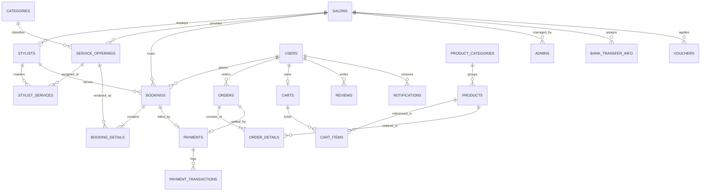

# TÀI LIỆU PHÂN TÍCH & THIẾT KẾ CƠ SỞ DỮ LIỆU TOÀN DIỆN
## HỆ THỐNG QUẢN LÝ ĐẶT LỊCH SALON & THƯƠNG MẠI ĐIỆN TỬ (BOOKINGSALON)

---

- **Vai trò thiết kế**: Chuyên viên Phân tích & Kiến trúc sư Dữ liệu Hệ thống (System Analyst / Data Architect)
- **Hệ quản trị CSDL mục tiêu**: MySQL 8.0+ (InnoDB Engine, utf8mb4_unicode_ci)
- **Quy chuẩn thiết kế**: Chuẩn hóa 3NF/BCNF, UUIDv4 Khóa chính `BINARY(16)` hiệu năng cao, Optimistic Locking (`version`), Soft-delete Pattern (`is_deleted`), Đầy đủ Audit Trail.
- **Yêu cầu đặc tả**: **Mỗi bảng có ít nhất 20 trường dữ liệu (>= 20 fields)** phản ánh đầy đủ nghiệp vụ vận hành thực tế của chuỗi Salon cao cấp kết hợp Shop bán lẻ mỹ phẩm nam.

---

## MỤC LỤC TỔNG QUAN

1. [TỔNG QUAN KIẾN TRÚC & NGUYÊN TẮC THIẾT KẾ](#1-tổng-quan-kiến-trúc--nguyên-tắc-thiết-kế)
2. [SƠ ĐỒ QUAN HỆ THỰC THỂ (ERD - ENTITY RELATIONSHIP DIAGRAM)](#2-sơ-đồ-quan-hệ-thực-thể-erd)
3. [DANH MỤC CÁC THỰC THỂ HỆ THỐNG](#3-danh-mục-các-thực-thể-hệ-thống)
4. [ĐẶC TẢ CHI TIẾT 22 BẢNG DỮ LIỆU (>= 20 TRƯỜNG / BẢNG)](#4-đặc-tả-chi-tiết-22-bảng-dữ-liệu)
   - [Bảng 1: users (Khách hàng)](#bảng-1-users-khách-hàng---30-trường)
   - [Bảng 2: stylists (Chuyên gia tạo mẫu tóc)](#bảng-2-stylists-chuyên-gia-tạo-mẫu-tóc---33-trường)
   - [Bảng 3: admins (Quản trị viên & Quản lý)](#bảng-3-admins-quản-trị-viên--quản-lý---26-trường)
   - [Bảng 4: salons (Chi nhánh Salon)](#bảng-4-salons-chi-nhánh-salon---31-trường)
   - [Bảng 5: categories (Danh mục dịch vụ làm đẹp)](#bảng-5-categories-danh-mục-dịch-vụ---23-trường)
   - [Bảng 6: service_offerings (Dịch vụ Salon)](#bảng-6-service_offerings-dịch-vụ-salon---28-trường)
   - [Bảng 7: stylist_services (Kỹ năng & Phân công dịch vụ Stylist)](#bảng-7-stylist_services-phân-công-kỹ-năng-stylist---21-trường)
   - [Bảng 8: bookings (Phiếu đặt lịch làm tóc)](#bảng-8-bookings-phiếu-đặt-lịch-hẹn---33-trường)
   - [Bảng 9: booking_details (Chi tiết dịch vụ lịch hẹn)](#bảng-9-booking_details-chi-tiết-dịch-vụ-lịch-hẹn---23-trường)
   - [Bảng 10: product_categories (Danh mục sản phẩm bán lẻ)](#bảng-10-product_categories-danh-mục-sản-phẩm---23-trường)
   - [Bảng 11: products (Sản phẩm chăm sóc tóc & mỹ phẩm)](#bảng-11-products-sản-phẩm-shop---33-trường)
   - [Bảng 12: carts (Giỏ hàng trực tuyến)](#bảng-12-carts-giỏ-hàng-người-dùng---23-trường)
   - [Bảng 13: cart_items (Chi tiết mặt hàng trong giỏ)](#bảng-13-cart_items-mặt-hàng-trong-giỏ---22-trường)
   - [Bảng 14: orders (Đơn hàng mua sắm sản phẩm)](#bảng-14-orders-đơn-hàng-sản-phẩm---34-trường)
   - [Bảng 15: order_details (Chi tiết mặt hàng trong đơn)](#bảng-15-order_details-chi-tiết-đơn-hàng---24-trường)
   - [Bảng 16: payments (Quản lý hóa đơn & thanh toán)](#bảng-16-payments-quản-lý-thanh-toán---26-trường)
   - [Bảng 17: payment_transactions (Giao dịch cổng VNPay / SePay)](#bảng-17-payment_transactions-giao-dịch-cổng-thanh-toán---25-trường)
   - [Bảng 18: bank_transfer_info (Tài khoản ngân hàng nhận tiền)](#bảng-18-bank_transfer_info-tài-khoản-ngân-hàng---23-trường)
   - [Bảng 19: reviews (Đánh giá & Nhận xét)](#bảng-19-reviews-đánh-giá--nhận-xét---26-trường)
   - [Bảng 20: notifications (Hệ thống thông báo đẩy & In-App)](#bảng-20-notifications-thông-báo-hệ-thống---24-trường)
   - [Bảng 21: media (Quản lý tài nguyên hình ảnh / video Cloud)](#bảng-21-media-quản-lý-đa-phương-tiện---25-trường)
   - [Bảng 22: vouchers (Mã ưu đãi & Khuyến mãi)](#bảng-22-vouchers-mã-khuyến-mãi---24-trường)
5. [CHIẾN LƯỢC ĐÁNH CHỈ MỤC (INDEXING STRATEGY) CHO TRUY VẤN TẢI CAO](#5-chiến-lược-đánh-chỉ-mục-indexing-strategy)
6. [KỊCH BẢN DDL TẠO BẢNG CHUẨN MYSQL 8+ (MẪU)](#6-kịch-bản-ddl-tạo-bảng-chuẩn-mysql-8)

---

## 1. TỔNG QUAN KIẾN TRÚC & NGUYÊN TẮC THIẾT KẾ

Hệ thống **BookingSalon** được định vị là nền tảng quản trị chuỗi salon chuyên nghiệp kết hợp sàn bán lẻ mỹ phẩm nam (Omnichannel Hair Salon & Grooming Commerce). Cơ sở dữ liệu được thiết kế thỏa mãn các tiêu chuẩn khắt khe:

1. **Hiệu năng & Khóa chính (Primary Key)**:
   - Sử dụng `BINARY(16)` lưu trữ UUIDv4 giúp tiết kiệm không gian lưu trữ (16 bytes thay vì 36 bytes chuỗi), tối ưu hóa B-Tree Index cho InnoDB.
2. **Khả năng mở rộng & Đa chi nhánh (Multi-Branch Readiness)**:
   - Các bảng nghiệp vụ (`bookings`, `service_offerings`, `stylists`, `payments`, `vouchers`) đều gắn với `salon_id` để dễ dàng mở rộng sang mô hình chuỗi nhiều salon trên toàn quốc hoặc phân quyền dữ liệu theo chi nhánh.
3. **An toàn dữ liệu & Kiểm toán (Audit Trail & Compliance)**:
   - Chuẩn hóa các trường: `created_at`, `updated_at`, `created_by`, `updated_by`, `is_deleted` (Soft Delete), `deleted_at`.
   - Sử dụng trường `version BIGINT DEFAULT 0` hỗ trợ cơ chế **Optimistic Locking** của JPA/Hibernate nhằm loại trừ nguy cơ xung đột đặt trùng lịch (Double Booking) hoặc bán vượt tồn kho (Overselling).
4. **Tích hợp Identity & Access Management (Keycloak / OAuth2)**:
   - Trường `keycloak_id BINARY(16)` trên các bảng người dùng (`users`, `stylists`, `admins`) giúp đồng bộ xuyên suốt với hệ thống xác thực tập trung Keycloak SSO.

---

## 2. SƠ ĐỒ QUAN HỆ THỰC THỂ (ERD)



---

## 3. DANH MỤC CÁC THỰC THỂ HỆ THỐNG

| STT | Tên Bảng (Physical Table) | Ý Nghĩa Nghiệp Vụ | Số Lượng Trường (Fields) |
| :---: | :--- | :--- | :---: |
| 1 | `users` | Hồ sơ khách hàng & Tích điểm thành viên | **30** |
| 2 | `stylists` | Chuyên viên tạo mẫu tóc & Lương thưởng | **33** |
| 3 | `admins` | Ban quản trị hệ thống & Quản lý chi nhánh | **26** |
| 4 | `salons` | Chi nhánh Salon & Tọa độ bản đồ | **31** |
| 5 | `categories` | Danh mục dịch vụ làm tóc | **23** |
| 6 | `service_offerings` | Menu dịch vụ làm đẹp & Combo | **28** |
| 7 | `stylist_services` | Phân công kỹ năng & Bậc thợ dịch vụ | **21** |
| 8 | `bookings` | Phiếu đặt hẹn & Quản lý ca làm | **33** |
| 9 | `booking_details` | Dịch vụ chi tiết trong lịch hẹn | **23** |
| 10 | `product_categories` | Danh mục sản phẩm mỹ phẩm bán lẻ | **23** |
| 11 | `products` | Sản phẩm sáp, gôm, dầu gội, mỹ phẩm | **33** |
| 12 | `carts` | Giỏ hàng mua sắm người dùng | **23** |
| 13 | `cart_items` | Chi tiết mặt hàng lưu trong giỏ | **22** |
| 14 | `orders` | Đơn hàng mua sắm & Vận chuyển | **34** |
| 15 | `order_details` | Chi tiết sản phẩm trong đơn hàng | **24** |
| 16 | `payments` | Quản lý hóa đơn & Thanh toán | **26** |
| 17 | `payment_transactions` | Giao dịch cổng thanh toán VNPay / SePay | **25** |
| 18 | `bank_transfer_info` | Tài khoản ngân hàng quét VietQR SePay | **23** |
| 19 | `reviews` | Đánh giá, xếp hạng & Phản hồi dịch vụ | **26** |
| 20 | `notifications` | Thông báo đẩy Push Notification & In-App | **24** |
| 21 | `media` | Quản lý ảnh/video Cloudinary/S3 | **25** |
| 22 | `vouchers` | Mã khuyến mãi, giảm giá & Coupon | **24** |

---

## 4. ĐẶC TẢ CHI TIẾT 22 BẢNG DỮ LIỆU

### BẢNG 1: `users` (Khách hàng - 30 trường)
*Mô tả: Quản lý thông tin tài khoản khách hàng, tích điểm hạng thành viên và sở thích chăm sóc tóc cá nhân.*
### BẢNG 1: `users` (Khách hàng - 23 trường)
*Mô tả: Quản lý thông tin khách hàng, hạng thành viên, mã voucher ưu đãi và lịch sử trải nghiệm dịch vụ. Tài khoản được xác thực tập trung qua Keycloak (không lưu username/mật khẩu tại bảng này).*

| STT | Tên Cột | Kiểu Dữ Liệu | Ràng Buộc | Ý Nghĩa Nghiệp Vụ & Ghi Chú |
| :---: | :--- | :--- | :--- | :--- |
| 1 | `user_id` | `BINARY(16)` | PK | Định danh duy nhất của khách hàng (UUIDv4) |
| 2 | `keycloak_id` | `BINARY(16)` | NULL, INDEX | ID liên kết tài khoản tập trung trên Keycloak IAM |
| 3 | `username` | `VARCHAR(100)` | NOT NULL, UNIQUE | Tên đăng nhập tài khoản hệ thống |
| 4 | `full_name` | `VARCHAR(255)` | NOT NULL | Họ và tên đầy đủ của khách hàng |
| 5 | `email` | `VARCHAR(150)` | NULL, UNIQUE | Địa chỉ email liên hệ & nhận hóa đơn điện tử |
| 6 | `phone_number` | `VARCHAR(20)` | NOT NULL, UNIQUE | Số điện thoại đăng nhập & xác nhận OTP SMS |
| 7 | `password_hash` | `VARCHAR(255)` | NULL | Mật khẩu mã hóa BCrypt (dự phòng khi không qua SSO) |
| 8 | `gender` | `VARCHAR(10)` | DEFAULT 'OTHER' | Giới tính khách hàng (`MALE`, `FEMALE`, `OTHER`) |
| 9 | `date_of_birth` | `DATE` | NULL | Ngày sinh nhật (áp dụng ưu đãi tặng voucher sinh nhật) |
| 10 | `avatar_url` | `VARCHAR(500)` | NULL | Đường dẫn ảnh đại diện (CDN Cloudinary) |
| 11 | `address` | `VARCHAR(255)` | NULL | Địa chỉ nhà riêng / số nhà, tên đường |
| 12 | `city` | `VARCHAR(100)` | NULL | Tỉnh / Thành phố sinh sống |
| 13 | `district` | `VARCHAR(100)` | NULL | Quận / Huyện |
| 14 | `ward` | `VARCHAR(100)` | NULL | Phường / Xã |
| 15 | `membership_tier` | `VARCHAR(30)` | DEFAULT 'STANDARD' | Hạng thẻ: `STANDARD`, `SILVER`, `GOLD`, `DIAMOND` |
| 16 | `loyalty_points` | `INT` | DEFAULT 0 | Điểm thưởng tích lũy có thể quy đổi sang tiền giảm |
| 17 | `total_spent` | `DECIMAL(15,2)` | DEFAULT 0.00 | Tổng số tiền đã chi tiêu tích lũy tại hệ thống (VNĐ) |
| 18 | `total_bookings_count`| `INT` | DEFAULT 0 | Tổng số lượt đặt lịch cắt tóc thành công |
| 19 | `preferred_salon_id` | `BINARY(16)` | NULL, FK | Chi nhánh salon thân thiết khách thường ghé |
| 20 | `preferred_stylist_id`| `BINARY(16)`| NULL, FK | Stylist "ruột" mà khách hay chỉ định khi đặt lịch |
| 21 | `hair_condition_notes`| `TEXT` | NULL | Ghi chú chất tóc: da đầu dầu, tóc tơ, dị ứng thuốc nhuộm |
| 22 | `status` | `VARCHAR(30)` | DEFAULT 'ACTIVE' | Trạng thái tài khoản: `ACTIVE`, `SUSPENDED`, `BANNED` |
| 23 | `email_verified` | `BOOLEAN` | DEFAULT FALSE | Trạng thái đã xác thực email qua mã OTP hay chưa |
| 24 | `phone_verified` | `BOOLEAN` | DEFAULT FALSE | Trạng thái đã xác thực số điện thoại qua OTP SMS |
| 25 | `last_login_at` | `DATETIME` | NULL | Thời điểm đăng nhập gần nhất vào app/web |
| 26 | `last_login_ip` | `VARCHAR(45)` | NULL | Địa chỉ IPv4/IPv6 ở lần đăng nhập gần nhất |
| 27 | `version` | `BIGINT` | DEFAULT 0 | Khóa phiên bản phục vụ Optimistic Locking JPA |
| 28 | `is_deleted` | `BOOLEAN` | DEFAULT FALSE | Cờ xóa mềm (Soft Delete) |
| 29 | `created_at` | `TIMESTAMP` | DEFAULT CURRENT_TIMESTAMP | Thời điểm tài khoản được khởi tạo |
| 30 | `updated_at` | `TIMESTAMP` | ON UPDATE CURRENT_TIMESTAMP | Thời điểm cập nhật thông tin gần nhất |
| 2 | `keycloak_id` | `BINARY(16)` | NULL, INDEX | ID tài khoản đồng bộ tập trung trên Keycloak IAM |
| 3 | `full_name` | `VARCHAR(255)` | NOT NULL | Họ và tên đầy đủ của khách hàng |
| 4 | `email` | `VARCHAR(150)` | NULL, UNIQUE | Địa chỉ email nhận vé đặt lịch & hóa đơn điện tử |
| 5 | `phone_number` | `VARCHAR(20)` | NOT NULL, UNIQUE | Số điện thoại đăng nhập, nhận SMS OTP và liên hệ |
| 6 | `gender` | `VARCHAR(10)` | DEFAULT 'OTHER' | Giới tính khách hàng (`MALE`, `FEMALE`, `OTHER`) |
| 7 | `avatar_url` | `VARCHAR(500)` | NULL | Đường dẫn ảnh đại diện (CDN Cloudinary) |
| 8 | `address` | `VARCHAR(255)` | NULL | Địa chỉ nhà riêng / số nhà, tên đường |
| 9 | `city` | `VARCHAR(100)` | NULL | Tỉnh / Thành phố sinh sống |
| 10 | `district` | `VARCHAR(100)` | NULL | Quận / Huyện |
| 11 | `ward` | `VARCHAR(100)` | NULL | Phường / Xã |
| 12 | `membership_tier` | `VARCHAR(30)` | DEFAULT 'STANDARD' | Hạng thành viên: `STANDARD`, `SILVER`, `GOLD`, `DIAMOND` |
| 13 | `voucher_code` | `VARCHAR(50)` | NULL | Mã voucher ưu đãi cá nhân đang được lưu/áp dụng |
| 14 | `preferred_salon_id` | `BINARY(16)` | NULL, FK | Chi nhánh salon thân thiết khách thường ghé cắt |
| 15 | `status` | `VARCHAR(30)` | DEFAULT 'ACTIVE' | Trạng thái tài khoản: `ACTIVE`, `SUSPENDED`, `BANNED` |
| 16 | `email_verified` | `BOOLEAN` | DEFAULT FALSE | Trạng thái đã xác thực email |
| 17 | `phone_verified` | `BOOLEAN` | DEFAULT FALSE | Trạng thái đã xác thực số điện thoại |
| 18 | `last_login_at` | `DATETIME` | NULL | Thời điểm đăng nhập gần nhất vào hệ thống |
| 19 | `last_login_ip` | `VARCHAR(45)` | NULL | Địa chỉ IPv4/IPv6 ở lần đăng nhập gần nhất |
| 20 | `version` | `BIGINT` | DEFAULT 0 | Khóa phiên bản phục vụ Optimistic Locking JPA |
| 21 | `is_deleted` | `BOOLEAN` | DEFAULT FALSE | Cờ xóa mềm (Soft Delete) |
| 22 | `created_at` | `TIMESTAMP` | DEFAULT CURRENT_TIMESTAMP | Thời điểm tài khoản được khởi tạo |
| 23 | `updated_at` | `TIMESTAMP` | ON UPDATE CURRENT_TIMESTAMP | Thời điểm cập nhật thông tin gần nhất |

> **Quy tắc phân loại trạng thái Booking hiển thị cho User:**
> 1. **"Đang xác nhận" (`PENDING`)**: Khách vừa bấm đặt lịch, đang chờ thanh toán hoặc phiên thanh toán bị gián đoạn; đơn hàng chờ thanh toán được lưu tạm tại đây.
> 2. **"Đã xác nhận" (`CONFIRMED`)**: Khách đã thanh toán thành công qua cổng (VNPay/SePay) hoặc Salon đã xác nhận lịch hẹn.
> 3. **"Đơn hàng đã đặt" (`COMPLETED`)**: Các lịch hẹn / dịch vụ đã được thực hiện hoàn tất tại salon.

---

### BẢNG 2: `stylists` (Chuyên gia tạo mẫu tóc - 33 trường)
*Mô tả: Hồ sơ chuyên gia làm tóc, tay nghề, chi nhánh trực thuộc, chính sách lương hoa hồng và đánh giá năng lực.*
### BẢNG 2: `stylists` (Chuyên gia tạo mẫu tóc - 32 trường)
*Mô tả: Hồ sơ chuyên gia làm tóc, tay nghề, chi nhánh trực thuộc, chính sách lương hoa hồng và năng lực phục vụ. Tài khoản được xác thực tập trung qua Keycloak (không lưu username/mật khẩu tại bảng này).*

| STT | Tên Cột | Kiểu Dữ Liệu | Ràng Buộc | Ý Nghĩa Nghiệp Vụ & Ghi Chú |
| :---: | :--- | :--- | :--- | :--- |
| 1 | `stylist_id` | `BINARY(16)` | PK | Khóa chính duy nhất của stylist (UUIDv4) |
| 2 | `keycloak_id` | `BINARY(16)` | NULL, INDEX | ID tài khoản đồng bộ trên Keycloak IAM |
| 3 | `username` | `VARCHAR(100)` | NOT NULL, UNIQUE | Tên tài khoản đăng nhập portal stylist |
| 4 | `full_name` | `VARCHAR(255)` | NOT NULL | Họ và tên đầy đủ trên giấy tờ |
| 5 | `nickname` | `VARCHAR(100)` | NULL | Nghệ danh làm việc tại salon (ví dụ: Alex Bach) |
| 6 | `email` | `VARCHAR(150)` | NULL | Email liên lạc nội bộ |
| 7 | `phone_number` | `VARCHAR(20)` | NOT NULL, UNIQUE | Số điện thoại liên lạc chính thức |
| 8 | `salon_id` | `BINARY(16)` | NOT NULL, FK | Khóa ngoại trỏ đến salon chi nhánh công tác |
| 9 | `avatar_url` | `VARCHAR(500)` | NULL | Ảnh chân dung chuyên nghiệp của stylist |
| 10 | `bio` | `TEXT` | NULL | Đoạn giới thiệu phong cách làm tóc & kinh nghiệm |
| 11 | `experience_years` | `DECIMAL(3,1)` | DEFAULT 1.0 | Số năm kinh nghiệm trong ngành tóc |
| 12 | `specialties` | `VARCHAR(255)` | NULL | Sở trường: Uốn Textured, Tẩy Nhuộm Khói, Fade sắc nét |
| 13 | `level_rank` | `VARCHAR(50)` | DEFAULT 'SENIOR'| Bậc thợ: `JUNIOR`, `SENIOR`, `MASTER`, `DIRECTOR` |
| 14 | `rating_average` | `DECIMAL(3,2)` | DEFAULT 5.00 | Điểm đánh giá trung bình từ khách hàng (1.00 - 5.00) |
| 15 | `total_reviews_count`| `INT` | DEFAULT 0 | Tổng số lượt khách đã gửi đánh giá |
| 16 | `total_served_bookings`| `INT`| DEFAULT 0 | Tổng số ca đặt lịch đã phục vụ hoàn tất |
| 17 | `base_salary` | `DECIMAL(15,2)` | DEFAULT 0.00 | Lương cơ bản hàng tháng (VNĐ) |
| 18 | `commission_rate` | `DECIMAL(5,2)` | DEFAULT 10.00 | Tỷ lệ hoa hồng trên tổng doanh số dịch vụ (%) |
| 19 | `tip_balance` | `DECIMAL(15,2)` | DEFAULT 0.00 | Tiền boa tích lũy chờ rút qua ngân hàng (VNĐ) |
| 20 | `join_date` | `DATE` | NOT NULL | Ngày ký hợp đồng bắt đầu làm việc tại chuỗi |
| 21 | `leave_date` | `DATE` | NULL | Ngày thôi việc hoặc kết thúc hợp đồng |
| 22 | `work_shift_type` | `VARCHAR(50)` | DEFAULT 'FULL_TIME' | Ca làm việc: `MORNING`, `AFTERNOON`, `FULL_TIME` |
| 23 | `max_parallel_slots` | `INT` | DEFAULT 1 | Số lượng khách tối đa phục vụ cùng lúc tại ghế |
| 24 | `citizen_id` | `VARCHAR(20)` | NULL | Số căn cước công dân (CCCD) |
| 25 | `bank_account_number`| `VARCHAR(50)`| NULL | Số tài khoản ngân hàng nhận lương/hoa hồng |
| 26 | `bank_name` | `VARCHAR(100)` | NULL | Tên ngân hàng nhận lương |
| 27 | `address` | `VARCHAR(255)` | NULL | Địa chỉ cư trú hiện tại |
| 28 | `is_featured` | `BOOLEAN` | DEFAULT FALSE | Cờ ưu tiên ghim stylist lên banner trang chủ |
| 29 | `status` | `VARCHAR(30)` | DEFAULT 'ACTIVE' | Trạng thái: `ACTIVE`, `ON_LEAVE`, `RESIGNED` |
| 30 | `version` | `BIGINT` | DEFAULT 0 | Phiên bản Optimistic Locking |
| 31 | `is_deleted` | `BOOLEAN` | DEFAULT FALSE | Soft delete |
| 32 | `created_at` | `TIMESTAMP` | DEFAULT CURRENT_TIMESTAMP | Thời điểm tạo bản ghi |
| 33 | `updated_at` | `TIMESTAMP` | ON UPDATE CURRENT_TIMESTAMP | Thời điểm cập nhật bản ghi |
| 3 | `full_name` | `VARCHAR(255)` | NOT NULL | Họ và tên đầy đủ trên giấy tờ |
| 4 | `nickname` | `VARCHAR(100)` | NULL | Nghệ danh làm việc tại salon (ví dụ: Alex Bach) |
| 5 | `email` | `VARCHAR(150)` | NULL | Email liên lạc nội bộ |
| 6 | `phone_number` | `VARCHAR(20)` | NOT NULL, UNIQUE | Số điện thoại liên lạc chính thức |
| 7 | `salon_id` | `BINARY(16)` | NOT NULL, FK | Khóa ngoại trỏ đến salon chi nhánh công tác |
| 8 | `avatar_url` | `VARCHAR(500)` | NULL | Ảnh chân dung chuyên nghiệp của stylist |
| 9 | `bio` | `TEXT` | NULL | Đoạn giới thiệu phong cách làm tóc & kinh nghiệm |
| 10 | `experience_years` | `DECIMAL(3,1)` | DEFAULT 1.0 | Số năm kinh nghiệm trong ngành tóc |
| 11 | `specialties` | `VARCHAR(255)` | NULL | Sở trường: Uốn Textured, Tẩy Nhuộm Khói, Fade sắc nét |
| 12 | `level_rank` | `VARCHAR(50)` | DEFAULT 'SENIOR'| Bậc thợ: `JUNIOR`, `SENIOR`, `MASTER`, `DIRECTOR` |
| 13 | `rating_average` | `DECIMAL(3,2)` | DEFAULT 5.00 | Điểm đánh giá trung bình từ khách hàng (1.00 - 5.00) |
| 14 | `total_reviews_count`| `INT` | DEFAULT 0 | Tổng số lượt khách đã gửi đánh giá |
| 15 | `total_served_bookings`| `INT`| DEFAULT 0 | Tổng số ca đặt lịch đã phục vụ hoàn tất |
| 16 | `base_salary` | `DECIMAL(15,2)` | DEFAULT 0.00 | Lương cơ bản hàng tháng (VNĐ) |
| 17 | `commission_rate` | `DECIMAL(5,2)` | DEFAULT 10.00 | Tỷ lệ hoa hồng trên tổng doanh số dịch vụ (%) |
| 18 | `tip_balance` | `DECIMAL(15,2)` | DEFAULT 0.00 | Tiền boa tích lũy chờ rút qua ngân hàng (VNĐ) |
| 19 | `join_date` | `DATE` | NOT NULL | Ngày ký hợp đồng bắt đầu làm việc tại chuỗi |
| 20 | `leave_date` | `DATE` | NULL | Ngày thôi việc hoặc kết thúc hợp đồng |
| 21 | `work_shift_type` | `VARCHAR(50)` | DEFAULT 'FULL_TIME' | Ca làm việc: `MORNING`, `AFTERNOON`, `FULL_TIME` |
| 22 | `max_parallel_slots` | `INT` | DEFAULT 1 | Số lượng khách tối đa phục vụ cùng lúc tại ghế |
| 23 | `citizen_id` | `VARCHAR(20)` | NULL | Số căn cước công dân (CCCD) |
| 24 | `bank_account_number`| `VARCHAR(50)`| NULL | Số tài khoản ngân hàng nhận lương/hoa hồng |
| 25 | `bank_name` | `VARCHAR(100)` | NULL | Tên ngân hàng nhận lương |
| 26 | `address` | `VARCHAR(255)` | NULL | Địa chỉ cư trú hiện tại |
| 27 | `is_featured` | `BOOLEAN` | DEFAULT FALSE | Cờ ưu tiên ghim stylist lên banner trang chủ |
| 28 | `status` | `VARCHAR(30)` | DEFAULT 'ACTIVE' | Trạng thái: `ACTIVE`, `ON_LEAVE`, `RESIGNED` |
| 29 | `version` | `BIGINT` | DEFAULT 0 | Phiên bản Optimistic Locking |
| 30 | `is_deleted` | `BOOLEAN` | DEFAULT FALSE | Soft delete |
| 31 | `created_at` | `TIMESTAMP` | DEFAULT CURRENT_TIMESTAMP | Thời điểm tạo bản ghi |
| 32 | `updated_at` | `TIMESTAMP` | ON UPDATE CURRENT_TIMESTAMP | Thời điểm cập nhật bản ghi |

> **Quy tắc phân loại 4 nhóm lịch hẹn của Stylist:**
> 1. **"Chờ xác nhận" (`PENDING`)**: Lịch mới book từ khách hoặc đang chờ thợ duyệt tiếp nhận.
> 2. **"Lịch cắt tóc" (`CONFIRMED` / `IN_PROGRESS`)**: Các lịch đã xác nhận, sắp tới giờ phục vụ hoặc đang diễn ra tại ghế cắt.
> 3. **"Đã hoàn thành" (`COMPLETED`)**: Các ca làm việc đã thực hiện xong dịch vụ, được tính doanh số và hoa hồng.
> 4. **"Đã hủy" (`CANCELLED`)**: Lịch hẹn bị khách hoặc salon hủy bỏ.

---

### BẢNG 3: `admins` (Quản trị viên & Quản lý - 26 trường)
*Mô tả: Quản lý nhân sự cấp quản lý, phân quyền quản trị chi nhánh và truy cập hệ thống.*

| STT | Tên Cột | Kiểu Dữ Liệu | Ràng Buộc | Ý Nghĩa Nghiệp Vụ & Ghi Chú |
| :---: | :--- | :--- | :--- | :--- |
| 1 | `admin_id` | `BINARY(16)` | PK | Khóa chính quản trị viên |
| 2 | `keycloak_id` | `BINARY(16)` | NULL, INDEX | ID đồng bộ tài khoản quản trị trên Keycloak |
| 3 | `username` | `VARCHAR(100)` | NOT NULL, UNIQUE | Tên đăng nhập Admin Dashboard |
| 4 | `full_name` | `VARCHAR(255)` | NOT NULL | Họ và tên người quản lý |
| 5 | `email` | `VARCHAR(150)` | NOT NULL, UNIQUE | Email nhận thông báo khẩn & bảo mật |
| 6 | `phone_number` | `VARCHAR(20)` | NOT NULL | Số điện thoại công vụ |
| 7 | `avatar_url` | `VARCHAR(500)` | NULL | Ảnh đại diện trên thanh menu quản trị |
| 8 | `admin_role` | `VARCHAR(50)` | DEFAULT 'SALON_MANAGER' | Vai trò: `SUPER_ADMIN`, `SALON_MANAGER`, `FINANCE_ADMIN` |
| 9 | `assigned_salon_id` | `BINARY(16)`| NULL, FK | Chi nhánh phụ trách trực tiếp (NULL = toàn chuỗi) |
| 10 | `department` | `VARCHAR(100)` | NULL | Phòng ban: Ban Giám Đốc, Vận Hành, Tài Chính |
| 11 | `employee_code` | `VARCHAR(50)` | NULL, UNIQUE | Mã nhân viên nội bộ (ví dụ: NV-ADM-001) |
| 12 | `citizen_id` | `VARCHAR(20)` | NULL | Số căn cước công dân |
| 13 | `address` | `VARCHAR(255)` | NULL | Địa chỉ thường trú |
| 14 | `emergency_contact_phone`| `VARCHAR(20)`| NULL | Số điện thoại người thân khi cần liên lạc khẩn |
| 15 | `status` | `VARCHAR(30)` | DEFAULT 'ACTIVE' | Trạng thái: `ACTIVE`, `LOCKED`, `INACTIVE` |
| 16 | `is_two_factor_enabled`| `BOOLEAN` | DEFAULT FALSE | Bật xác thực 2 lớp qua Google Authenticator |
| 17 | `two_factor_secret` | `VARCHAR(255)` | NULL | Chuỗi khóa bí mật TOTP 2FA |
| 18 | `last_login_at` | `DATETIME` | NULL | Lần cuối đăng nhập thành công vào Admin Panel |
| 19 | `last_login_ip` | `VARCHAR(45)` | NULL | Địa chỉ IP đăng nhập gần nhất |
| 20 | `failed_login_attempts`| `INT` | DEFAULT 0 | Số lần nhập sai mật khẩu liên tiếp |
| 21 | `lockout_until` | `DATETIME` | NULL | Thời điểm tạm khóa tài khoản nếu đăng nhập sai quá số lần |
| 22 | `permissions_cache` | `JSON` | NULL | Cache danh sách quyền hạn nhanh dưới dạng JSON |
| 23 | `version` | `BIGINT` | DEFAULT 0 | Phiên bản Optimistic Locking |
| 24 | `is_deleted` | `BOOLEAN` | DEFAULT FALSE | Xóa mềm |
| 25 | `created_at` | `TIMESTAMP` | DEFAULT CURRENT_TIMESTAMP | Thời gian tạo tài khoản |
| 26 | `updated_at` | `TIMESTAMP` | ON UPDATE CURRENT_TIMESTAMP | Thời gian cập nhật tài khoản |

---

### BẢNG 4: `salons` (Chi nhánh Salon - 31 trường)
*Mô tả: Thông tin chi tiết các chi nhánh salon, năng lực phục vụ, giờ làm việc và định vị GPS.*

| STT | Tên Cột | Kiểu Dữ Liệu | Ràng Buộc | Ý Nghĩa Nghiệp Vụ & Ghi Chú |
| :---: | :--- | :--- | :--- | :--- |
| 1 | `salon_id` | `BINARY(16)` | PK | Khóa chính chi nhánh Salon |
| 2 | `salon_code` | `VARCHAR(50)` | NOT NULL, UNIQUE | Mã chi nhánh chuẩn hóa (ví dụ: SL-HN-CAUGIAY) |
| 3 | `salon_name` | `VARCHAR(255)` | NOT NULL | Tên thương mại (ví dụ: BachBarber Cầu Giấy) |
| 4 | `slug` | `VARCHAR(255)` | NOT NULL, UNIQUE | Chuỗi URL thân thiện cho SEO web |
| 5 | `phone_number` | `VARCHAR(20)` | NOT NULL | Số điện thoại bàn chi nhánh |
| 6 | `hotline` | `VARCHAR(20)` | NULL | Số hotline tư vấn đặt hẹn nhanh |
| 7 | `email` | `VARCHAR(150)` | NOT NULL | Hòm thư điện tử của salon |
| 8 | `address_line` | `VARCHAR(255)` | NOT NULL | Địa chỉ chi tiết số nhà, tên đường |
| 9 | `ward` | `VARCHAR(100)` | NOT NULL | Phường / Xã |
| 10 | `district` | `VARCHAR(100)` | NOT NULL | Quận / Huyện |
| 11 | `city` | `VARCHAR(100)` | NOT NULL | Tỉnh / Thành phố |
| 12 | `latitude` | `DECIMAL(10,8)`| NULL | Tọa độ vĩ độ định vị Google Maps |
| 13 | `longitude` | `DECIMAL(11,8)`| NULL | Tọa độ kinh độ định vị Google Maps |
| 14 | `google_map_embed_url`| `TEXT` | NULL | Mã nhúng iframe bản đồ Google Maps |
| 15 | `open_time` | `TIME` | NOT NULL DEFAULT '08:30:00' | Giờ mở cửa đón khách buổi sáng |
| 16 | `close_time` | `TIME` | NOT NULL DEFAULT '21:30:00' | Giờ đóng cửa ngừng nhận khách |
| 17 | `slot_interval_minutes`| `INT` | DEFAULT 30 | Bước nhảy mỗi khung giờ đặt hẹn (30 phút / ca) |
| 18 | `capacity_seats` | `INT` | DEFAULT 10 | Tổng số ghế cắt tóc phục vụ đồng thời tại salon |
| 19 | `rating_average` | `DECIMAL(3,2)` | DEFAULT 5.00 | Điểm đánh giá trung bình của chi nhánh |
| 20 | `total_reviews_count`| `INT` | DEFAULT 0 | Tổng số lượt khách đánh giá chi nhánh |
| 21 | `amenities` | `JSON` | NULL | Tiện ích: WiFi Free, Chỗ đỗ ô tô, Trà đá, Điều hòa |
| 22 | `description` | `TEXT` | NULL | Bài viết giới thiệu không gian và cơ sở vật chất |
| 23 | `cover_image_url` | `VARCHAR(500)` | NULL | Ảnh bìa mặt tiền salon kích thước lớn |
| 24 | `manager_name` | `VARCHAR(150)` | NULL | Tên người quản lý phụ trách chi nhánh |
| 25 | `manager_phone` | `VARCHAR(20)` | NULL | SĐT liên hệ trực tiếp của quản lý salon |
| 26 | `is_featured` | `BOOLEAN` | DEFAULT FALSE | Đánh dấu salon tiêu biểu / Flagship store |
| 27 | `status` | `VARCHAR(30)` | DEFAULT 'ACTIVE' | Trạng thái: `ACTIVE`, `RENOVATING`, `CLOSED` |
| 28 | `version` | `BIGINT` | DEFAULT 0 | Khóa lạc quan |
| 29 | `is_deleted` | `BOOLEAN` | DEFAULT FALSE | Soft delete |
| 30 | `created_at` | `TIMESTAMP` | DEFAULT CURRENT_TIMESTAMP | Thời điểm tạo |
| 31 | `updated_at` | `TIMESTAMP` | ON UPDATE CURRENT_TIMESTAMP | Thời điểm cập nhật |

---

### BẢNG 5: `categories` (Danh mục dịch vụ - 23 trường)
*Mô tả: Phân nhóm các dịch vụ cắt, uốn, nhuộm, chăm sóc da mặt và combo trọn gói.*

| STT | Tên Cột | Kiểu Dữ Liệu | Ràng Buộc | Ý Nghĩa Nghiệp Vụ & Ghi Chú |
| :---: | :--- | :--- | :--- | :--- |
| 1 | `category_id` | `BINARY(16)` | PK | Khóa chính danh mục dịch vụ |
| 2 | `category_code` | `VARCHAR(50)` | NOT NULL, UNIQUE | Mã danh mục (ví dụ: CAT-HAIRCUT, CAT-PERM) |
| 3 | `category_name` | `VARCHAR(255)` | NOT NULL | Tên hiển thị: Cắt tóc tạo kiểu, Uốn tóc Hàn Quốc |
| 4 | `slug` | `VARCHAR(255)` | NOT NULL, UNIQUE | Đường dẫn tĩnh thân thiện SEO |
| 5 | `description` | `TEXT` | NULL | Giới thiệu công nghệ và quy trình nhóm dịch vụ |
| 6 | `parent_category_id` | `BINARY(16)`| NULL, FK | ID danh mục cha (hỗ trợ phân cấp cây đa cấp) |
| 7 | `image_url` | `VARCHAR(500)` | NULL | Ảnh minh họa đại diện cho danh mục |
| 8 | `banner_url` | `VARCHAR(500)` | NULL | Banner quảng cáo danh mục trên web/app |
| 9 | `icon_class` | `VARCHAR(100)` | NULL | Tên class biểu tượng (FontAwesome / Ant Design) |
| 10 | `sort_order` | `INT` | DEFAULT 0 | Thứ tự sắp xếp hiển thị trên giao diện |
| 11 | `is_active` | `BOOLEAN` | DEFAULT TRUE | Trạng thái kích hoạt cho phép đặt lịch |
| 12 | `is_popular` | `BOOLEAN` | DEFAULT FALSE | Danh mục nổi bật được nhiều khách chọn |
| 13 | `target_gender` | `VARCHAR(20)` | DEFAULT 'ALL' | Đối tượng: `MEN`, `WOMEN`, `UNISEX`, `KIDS` |
| 14 | `meta_title` | `VARCHAR(255)` | NULL | Thẻ tiêu đề phục vụ SEO |
| 15 | `meta_description`| `VARCHAR(500)` | NULL | Thẻ mô tả tóm tắt nội dung SEO |
| 16 | `meta_keywords` | `VARCHAR(255)` | NULL | Từ khóa tìm kiếm SEO |
| 17 | `total_services_count`| `INT` | DEFAULT 0 | Số lượng dịch vụ con thuộc danh mục này |
| 18 | `applied_vat_percent` | `DECIMAL(4,2)`| DEFAULT 8.00 | Tỷ lệ thuế VAT áp dụng (%) |
| 19 | `highlight_badge` | `VARCHAR(50)` | NULL | Huy hiệu gắn kèm: `HOT`, `NEW`, `COMBO TIẾT KIỆM` |
| 20 | `version` | `BIGINT` | DEFAULT 0 | Phiên bản khóa lạc quan |
| 21 | `is_deleted` | `BOOLEAN` | DEFAULT FALSE | Soft delete |
| 22 | `created_at` | `TIMESTAMP` | DEFAULT CURRENT_TIMESTAMP | Thời điểm tạo |
| 23 | `updated_at` | `TIMESTAMP` | ON UPDATE CURRENT_TIMESTAMP | Thời điểm cập nhật |

---

### BẢNG 6: `service_offerings` (Dịch vụ Salon - 28 trường)
*Mô tả: Chi tiết các gói dịch vụ làm tóc đơn lẻ hoặc combo nhiều bước, giá cả, thời lượng thực hiện.*

| STT | Tên Cột | Kiểu Dữ Liệu | Ràng Buộc | Ý Nghĩa Nghiệp Vụ & Ghi Chú |
| :---: | :--- | :--- | :--- | :--- |
| 1 | `service_offering_id` | `BINARY(16)` | PK | Khóa chính dịch vụ |
| 2 | `service_code` | `VARCHAR(50)` | NOT NULL, UNIQUE | Mã dịch vụ (ví dụ: SRV-SHINE-COMBO-7B) |
| 3 | `name` | `VARCHAR(255)` | NOT NULL | Tên dịch vụ: Cắt gội massage bấm huyệt 7 bước |
| 4 | `slug` | `VARCHAR(255)` | NOT NULL, UNIQUE | Đường dẫn thân thiện SEO |
| 5 | `short_description` | `VARCHAR(500)` | NULL | Mô tả tóm tắt ngắn gọn hiển thị trên thẻ card |
| 6 | `full_description` | `TEXT` | NOT NULL | Chi tiết tường tận từng bước kỹ thuật |
| 7 | `category_id` | `BINARY(16)` | NOT NULL, FK | Danh mục dịch vụ |
| 8 | `salon_id` | `BINARY(16)` | NOT NULL, FK | Chi nhánh salon cung cấp dịch vụ |
| 9 | `base_price` | `DECIMAL(15,2)` | NOT NULL | Giá niêm yết gốc dịch vụ (VNĐ) |
| 10 | `promotional_price`| `DECIMAL(15,2)` | NULL | Giá ưu đãi khuyến mãi nếu có (VNĐ) |
| 11 | `duration_minutes` | `INT` | NOT NULL DEFAULT 45 | Thời gian thực hiện dịch vụ (phút) |
| 12 | `buffer_time_minutes`| `INT` | DEFAULT 5 | Thời gian nghỉ/vệ sinh kéo ghế sau dịch vụ |
| 13 | `image_url` | `VARCHAR(500)` | NOT NULL | Ảnh minh họa chính của gói dịch vụ |
| 14 | `gallery_urls` | `JSON` | NULL | Bộ sưu tập ảnh các mẫu tóc hoàn thiện từ gói này |
| 15 | `usage_count` | `INT` | DEFAULT 0 | Tổng số lượt khách đã từng đặt dịch vụ này |
| 16 | `rating_average` | `DECIMAL(3,2)` | DEFAULT 5.00 | Điểm đánh giá trung bình từ khách |
| 17 | `review_count` | `INT` | DEFAULT 0 | Số lượt đánh giá |
| 18 | `is_featured` | `BOOLEAN` | DEFAULT FALSE | Hiển thị ở mục nổi bật trang chủ |
| 19 | `is_combo` | `BOOLEAN` | DEFAULT FALSE | Cờ xác định đây là gói combo nhiều công đoạn |
| 20 | `combo_steps` | `JSON` | NULL | Danh sách các bước: Rửa mặt, Gội, Cắt, Vuốt sáp |
| 21 | `required_skill_level`| `VARCHAR(50)`| DEFAULT 'JUNIOR' | Bậc thợ tối thiểu có thể cắt: `JUNIOR`, `SENIOR`, `MASTER` |
| 22 | `sort_order` | `INT` | DEFAULT 0 | Thứ tự hiển thị menu |
| 23 | `status` | `VARCHAR(30)` | DEFAULT 'ACTIVE' | Trạng thái: `ACTIVE`, `OUT_OF_SERVICE` |
| 24 | `deleted_at` | `DATETIME` | NULL | Thời điểm xóa khỏi menu |
| 25 | `version` | `BIGINT` | DEFAULT 0 | Optimistic locking |
| 26 | `is_deleted` | `BOOLEAN` | DEFAULT FALSE | Soft delete |
| 27 | `created_at` | `TIMESTAMP` | DEFAULT CURRENT_TIMESTAMP | Thời gian tạo |
| 28 | `updated_at` | `TIMESTAMP` | ON UPDATE CURRENT_TIMESTAMP | Thời gian sửa |

---

### BẢNG 7: `stylist_services` (Phân công kỹ năng Stylist - 21 trường)
*Mô tả: Ma trận kỹ năng, tay nghề của stylist đối với từng dịch vụ cụ thể và hoa hồng tương ứng.*

| STT | Tên Cột | Kiểu Dữ Liệu | Ràng Buộc | Ý Nghĩa Nghiệp Vụ & Ghi Chú |
| :---: | :--- | :--- | :--- | :--- |
| 1 | `id` | `BINARY(16)` | PK | Khóa chính bảng liên kết |
| 2 | `stylist_id` | `BINARY(16)` | NOT NULL, FK | Stylist phụ trách |
| 3 | `service_offering_id`| `BINARY(16)` | NOT NULL, FK | Dịch vụ tương ứng |
| 4 | `proficiency_level` | `VARCHAR(50)` | DEFAULT 'PROFICIENT' | Mức độ thành thạo: `LEARNER`, `PROFICIENT`, `EXPERT` |
| 5 | `custom_duration_minutes`| `INT` | NULL | Thời gian riêng của thợ này (nếu làm nhanh/chậm hơn) |
| 6 | `custom_price_surcharge` | `DECIMAL(15,2)`| DEFAULT 0.00 | Phụ thu tay nghề Master cho dịch vụ này nếu có |
| 7 | `is_enabled` | `BOOLEAN` | DEFAULT TRUE | Cho phép nhận lịch hẹn dịch vụ này |
| 8 | `times_performed` | `INT` | DEFAULT 0 | Số lần thợ này đã hoàn thành dịch vụ |
| 9 | `rating_score` | `DECIMAL(3,2)` | DEFAULT 5.00 | Điểm đánh giá riêng cho dịch vụ này của thợ |
| 10 | `feedback_positive_rate`| `DECIMAL(5,2)`| DEFAULT 100.00| Tỷ lệ đánh giá 5 sao (%) |
| 11 | `certified_date` | `DATE` | NULL | Ngày thi đậu chứng chỉ nội bộ làm dịch vụ này |
| 12 | `trainer_evaluator_id`| `BINARY(16)`| NULL, FK | Quản lý / Master chấm điểm duyệt tay nghề |
| 13 | `approval_status` | `VARCHAR(30)` | DEFAULT 'APPROVED' | Trạng thái duyệt: `PENDING`, `APPROVED`, `REVOKED` |
| 14 | `commission_percentage`| `DECIMAL(5,2)`| DEFAULT 10.00 | % hoa hồng cho dịch vụ này |
| 15 | `fixed_bonus_per_service`| `DECIMAL(15,2)`| DEFAULT 0.00| Thưởng nóng cố định trên mỗi lượt phục vụ |
| 16 | `max_daily_capacity` | `INT` | DEFAULT 15 | Giới hạn số ca dịch vụ này tối đa trong 1 ngày |
| 17 | `notes` | `VARCHAR(500)` | NULL | Nhận xét chuyên môn từ quản lý |
| 18 | `version` | `BIGINT` | DEFAULT 0 | Khóa phiên bản |
| 19 | `is_deleted` | `BOOLEAN` | DEFAULT FALSE | Soft delete |
| 20 | `created_at` | `TIMESTAMP` | DEFAULT CURRENT_TIMESTAMP | Thời điểm gán kỹ năng |
| 21 | `updated_at` | `TIMESTAMP` | ON UPDATE CURRENT_TIMESTAMP | Thời điểm cập nhật |

---

### BẢNG 8: `bookings` (Phiếu đặt lịch hẹn - 33 trường)
*Mô tả: Quản lý lịch hẹn làm tóc của khách, thời gian bắt đầu, kết thúc, thợ thực hiện, tiền bạc và trạng thái ca làm.*

| STT | Tên Cột | Kiểu Dữ Liệu | Ràng Buộc | Ý Nghĩa Nghiệp Vụ & Ghi Chú |
| :---: | :--- | :--- | :--- | :--- |
| 1 | `booking_id` | `BINARY(16)` | PK | Khóa chính lịch hẹn |
| 2 | `booking_code` | `VARCHAR(50)` | NOT NULL, UNIQUE | Mã vé hẹn gửi khách: `BK-20260915-8942` |
| 3 | `user_id` | `BINARY(16)` | NOT NULL, FK | Tài khoản khách hàng đặt lịch |
| 4 | `salon_id` | `BINARY(16)` | NOT NULL, FK | Chi nhánh salon tiếp nhận khách |
| 5 | `stylist_id` | `BINARY(16)` | NOT NULL, FK | Chuyên gia tạo mẫu tóc được chỉ định |
| 6 | `customer_name` | `VARCHAR(255)` | NOT NULL | Tên người đến làm tóc (hỗ trợ đặt hộ người thân) |
| 7 | `customer_phone` | `VARCHAR(20)` | NOT NULL | Số điện thoại liên hệ xác nhận lịch |
| 8 | `customer_email` | `VARCHAR(150)` | NULL | Email nhận vé đặt hẹn & mã QR check-in |
| 9 | `start_time` | `DATETIME` | NOT NULL, INDEX | Thời gian bắt đầu dự kiến của lịch hẹn |
| 10 | `end_time` | `DATETIME` | NOT NULL, INDEX | Thời gian kết thúc dự kiến |
| 11 | `actual_checkin_time`| `DATETIME` | NULL | Giờ lễ tân quét mã QR đón khách tại salon |
| 12 | `actual_checkout_time`| `DATETIME` | NULL | Giờ khách thanh toán và ra về |
| 13 | `status` | `VARCHAR(30)` | NOT NULL DEFAULT 'PENDING' | Trạng thái: `PENDING`, `CONFIRMED`, `CHECKED_IN`, `IN_PROGRESS`, `COMPLETED`, `CANCELLED`, `NO_SHOW` |
| 14 | `subtotal_amount` | `DECIMAL(15,2)` | NOT NULL DEFAULT 0.00 | Tổng tiền dịch vụ trước giảm giá |
| 15 | `discount_amount` | `DECIMAL(15,2)` | DEFAULT 0.00 | Tiền giảm giá theo chương trình / voucher |
| 16 | `voucher_code` | `VARCHAR(50)` | NULL | Mã khuyến mại áp dụng cho đơn hẹn |
| 17 | `loyalty_points_used`| `INT` | DEFAULT 0 | Số điểm thưởng đã tiêu |
| 18 | `loyalty_points_discount`| `DECIMAL(15,2)`| DEFAULT 0.00| Số tiền được trừ từ điểm thưởng |
| 19 | `total_amount` | `DECIMAL(15,2)` | NOT NULL | Số tiền thanh toán cuối cùng khách phải trả |
| 20 | `payment_status` | `VARCHAR(30)` | DEFAULT 'UNPAID' | `UNPAID`, `PARTIALLY_PAID`, `PAID`, `REFUNDED` |
| 21 | `payment_method` | `VARCHAR(50)` | DEFAULT 'CASH' | `CASH`, `VNPAY`, `SEPAY`, `MOMO`, `POINTS` |
| 22 | `seat_chair_number`| `VARCHAR(20)` | NULL | Số ghế cắt tóc phục vụ (ví dụ: Ghế số 04) |
| 23 | `cancellation_reason`| `VARCHAR(500)`| NULL | Lý do hủy lịch hẹn |
| 24 | `cancelled_by` | `VARCHAR(50)` | NULL | Người hủy: `CUSTOMER`, `STYLIST`, `ADMIN`, `SYSTEM` |
| 25 | `cancelled_at` | `DATETIME` | NULL | Thời điểm phát sinh lệnh hủy hẹn |
| 26 | `customer_notes` | `TEXT` | NULL | Ghi chú của khách: "Cắt ngắn 2 bên, giữ mái dài" |
| 27 | `stylist_notes` | `TEXT` | NULL | Thợ ghi chú chất tóc và cách phối màu cho lần sau |
| 28 | `is_reviewed` | `BOOLEAN` | DEFAULT FALSE | Khách đã hoàn thành đánh giá sao hay chưa |
| 29 | `booking_source` | `VARCHAR(30)` | DEFAULT 'WEB' | Nguồn đặt: `WEB`, `APP`, `WALK_IN`, `CALL_CENTER` |
| 30 | `version` | `BIGINT` | DEFAULT 0 | Khóa phiên bản chống Double Booking |
| 31 | `is_deleted` | `BOOLEAN` | DEFAULT FALSE | Soft delete |
| 32 | `created_at` | `TIMESTAMP` | DEFAULT CURRENT_TIMESTAMP | Thời gian đặt hẹn |
| 33 | `updated_at` | `TIMESTAMP` | ON UPDATE CURRENT_TIMESTAMP | Thời gian cập nhật trạng thái |

---

### BẢNG 9: `booking_details` (Chi tiết dịch vụ lịch hẹn - 23 trường)
*Mô tả: Từng dịch vụ con trong một buổi cắt tóc (ví dụ: 1 lịch hẹn gồm Cắt tóc + Uốn tóc + Nhuộm).*

| STT | Tên Cột | Kiểu Dữ Liệu | Ràng Buộc | Ý Nghĩa Nghiệp Vụ & Ghi Chú |
| :---: | :--- | :--- | :--- | :--- |
| 1 | `booking_detail_id`| `BINARY(16)` | PK | Khóa chính chi tiết lịch hẹn |
| 2 | `booking_id` | `BINARY(16)` | NOT NULL, FK | Khóa ngoại trỏ đến lịch hẹn cha |
| 3 | `service_offering_id`| `BINARY(16)` | NOT NULL, FK | Khóa ngoại dịch vụ làm tóc |
| 4 | `service_name_snapshot`| `VARCHAR(255)`| NOT NULL | Chụp lại tên dịch vụ tại thời điểm đặt lịch |
| 5 | `current_price` | `DECIMAL(15,2)` | NOT NULL | Giá gốc của dịch vụ lúc đặt vé |
| 6 | `discount_price` | `DECIMAL(15,2)` | DEFAULT 0.00 | Mức chiết khấu cho dịch vụ này |
| 7 | `final_price` | `DECIMAL(15,2)` | NOT NULL | Giá thực tế tính vào hóa đơn |
| 8 | `duration_minutes` | `INT` | NOT NULL DEFAULT 30 | Thời lượng dự kiến cho khâu này |
| 9 | `step_order` | `INT` | DEFAULT 1 | Thứ tự thực hiện: 1. Rửa mặt -> 2. Cắt -> 3. Uốn |
| 10 | `assistant_stylist_id`| `BINARY(16)`| NULL, FK | Thợ phụ (Skinner) gội đầu / vào thuốc hỗ trợ |
| 11 | `service_status` | `VARCHAR(30)` | DEFAULT 'PENDING' | `PENDING`, `IN_PROGRESS`, `DONE`, `SKIPPED` |
| 12 | `service_start_time`| `DATETIME` | NULL | Giờ thực tế bắt đầu công đoạn |
| 13 | `service_end_time` | `DATETIME` | NULL | Giờ thực tế hoàn thành công đoạn |
| 14 | `commission_amount`| `DECIMAL(15,2)` | DEFAULT 0.00 | Hoa hồng stylist chính nhận được cho món này |
| 15 | `assistant_commission_amount`| `DECIMAL(15,2)`| DEFAULT 0.00| Hoa hồng thợ phụ nhận được |
| 16 | `chemical_formula_used`| `VARCHAR(500)`| NULL | Công thức pha thuốc uốn/nhuộm đã dùng |
| 17 | `customer_feedback_snippet`| `VARCHAR(255)`| NULL | Nhận xét nhanh của khách sau khi xong khâu |
| 18 | `extra_charges` | `DECIMAL(15,2)` | DEFAULT 0.00 | Phụ phí phát sinh (nâng cấp loại thuốc cao cấp) |
| 19 | `extra_charges_reason`| `VARCHAR(255)`| NULL | Lý do phát sinh phụ phí |
| 20 | `version` | `BIGINT` | DEFAULT 0 | Khóa lạc quan |
| 21 | `is_deleted` | `BOOLEAN` | DEFAULT FALSE | Soft delete |
| 22 | `created_at` | `TIMESTAMP` | DEFAULT CURRENT_TIMESTAMP | Thời điểm tạo |
| 23 | `updated_at` | `TIMESTAMP` | ON UPDATE CURRENT_TIMESTAMP | Thời điểm cập nhật |

---

### BẢNG 10: `product_categories` (Danh mục sản phẩm - 23 trường)
*Mô tả: Phân nhóm các mặt hàng bán lẻ: Sáp vuốt tóc, Gôm xịt, Dầu gội, Tinh dầu dưỡng tóc.*

| STT | Tên Cột | Kiểu Dữ Liệu | Ràng Buộc | Ý Nghĩa Nghiệp Vụ & Ghi Chú |
| :---: | :--- | :--- | :--- | :--- |
| 1 | `category_id` | `BINARY(16)` | PK | Khóa chính danh mục sản phẩm |
| 2 | `category_code` | `VARCHAR(50)` | NOT NULL, UNIQUE | Mã danh mục: `CAT-WAX`, `CAT-SHAMPOO` |
| 3 | `name` | `VARCHAR(255)` | NOT NULL, UNIQUE | Tên danh mục: Sáp vuốt tóc nam cao cấp |
| 4 | `slug` | `VARCHAR(255)` | NOT NULL, UNIQUE | Chuỗi URL thân thiện SEO |
| 5 | `parent_id` | `BINARY(16)` | NULL, FK | ID danh mục cha (hỗ trợ phân cấp) |
| 6 | `description` | `TEXT` | NULL | Giới thiệu công dụng nhóm sản phẩm |
| 7 | `image_url` | `VARCHAR(500)` | NULL | Ảnh thumbnail đại diện nhóm sản phẩm |
| 8 | `banner_url` | `VARCHAR(500)` | NULL | Banner hiển thị đầu trang cửa hàng |
| 9 | `icon_class` | `VARCHAR(100)` | NULL | Tên class icon |
| 10 | `sort_order` | `INT` | DEFAULT 0 | Thứ tự sắp xếp hiển thị |
| 11 | `is_active` | `BOOLEAN` | DEFAULT TRUE | Kích hoạt mở bán trên shop |
| 12 | `is_featured` | `BOOLEAN` | DEFAULT FALSE | Ghim vào mục danh mục nổi bật |
| 13 | `meta_title` | `VARCHAR(255)` | NULL | Thẻ title phục vụ SEO trang |
| 14 | `meta_description`| `VARCHAR(500)` | NULL | Thẻ meta description SEO |
| 15 | `meta_keywords` | `VARCHAR(255)` | NULL | Từ khóa SEO |
| 16 | `total_products_count`| `INT` | DEFAULT 0 | Số lượng sản phẩm đang có trong nhóm |
| 17 | `display_layout` | `VARCHAR(50)` | DEFAULT 'GRID' | Kiểu hiển thị layout: `GRID`, `LIST` |
| 18 | `badge_label` | `VARCHAR(50)` | NULL | Nhãn huy hiệu: `HOT SALE`, `NHẬP KHẨU CHÍNH HÃNG` |
| 19 | `default_vat_rate`| `DECIMAL(4,2)`| DEFAULT 10.00 | Tỷ lệ thuế GTGT mặc định (%) |
| 20 | `version` | `BIGINT` | DEFAULT 0 | Khóa phiên bản |
| 21 | `is_deleted` | `BOOLEAN` | DEFAULT FALSE | Soft delete |
| 22 | `created_at` | `TIMESTAMP` | DEFAULT CURRENT_TIMESTAMP | Thời điểm tạo |
| 23 | `updated_at` | `TIMESTAMP` | ON UPDATE CURRENT_TIMESTAMP | Thời điểm sửa |

---

### BẢNG 11: `products` (Sản phẩm Shop - 33 trường)
*Mô tả: Thông tin chi tiết các mặt hàng mỹ phẩm, giá nhập, giá bán, mã vạch, tồn kho và trọng lượng tính phí ship.*

| STT | Tên Cột | Kiểu Dữ Liệu | Ràng Buộc | Ý Nghĩa Nghiệp Vụ & Ghi Chú |
| :---: | :--- | :--- | :--- | :--- |
| 1 | `product_id` | `BINARY(16)` | PK | Khóa chính sản phẩm |
| 2 | `sku` | `VARCHAR(50)` | NOT NULL, UNIQUE | Mã quản lý tồn kho: `WAX-GLANZ-MATTE-68G` |
| 3 | `barcode` | `VARCHAR(50)` | NULL, UNIQUE | Mã vạch chuẩn EAN-13 quét tại quầy thu ngân |
| 4 | `name` | `VARCHAR(255)` | NOT NULL | Tên sản phẩm đầy đủ |
| 5 | `slug` | `VARCHAR(255)` | NOT NULL, UNIQUE | Đường dẫn tĩnh thân thiện SEO |
| 6 | `brand` | `VARCHAR(100)` | NULL | Thương hiệu: Kevin Murphy, Hanz de Fuko, Blumaan |
| 7 | `category_id` | `BINARY(16)` | NOT NULL, FK | Khóa ngoại danh mục sản phẩm |
| 8 | `short_description` | `VARCHAR(500)` | NULL | Tóm tắt độ giữ nếp, độ bóng, mùi hương |
| 9 | `description` | `TEXT` | NULL | Chi tiết đặc tính sản phẩm & phong cách phù hợp |
| 10 | `ingredients` | `TEXT` | NULL | Bảng thành phần công thức hóa mỹ phẩm |
| 11 | `usage_instructions`| `TEXT` | NULL | Hướng dẫn cách xoa sáp và sấy tạo kiểu |
| 12 | `cost_price` | `DECIMAL(15,2)` | DEFAULT 0.00 | Giá vốn nhập kho (phục vụ báo cáo lãi lỗ P&L) |
| 13 | `price` | `DECIMAL(15,2)` | NOT NULL | Giá bán lẻ hiện tại (VNĐ) |
| 14 | `original_price` | `DECIMAL(15,2)` | NULL | Giá niêm yết gạch bỏ tạo hiệu ứng khuyến mãi |
| 15 | `stock_quantity` | `INT` | NOT NULL DEFAULT 0 | Số lượng hàng tồn khả dụng trong kho |
| 16 | `low_stock_threshold`| `INT` | DEFAULT 5 | Ngưỡng báo động sắp hết hàng cần nhập thêm |
| 17 | `sold_count` | `INT` | DEFAULT 0 | Tổng số lượng sản phẩm đã bán ra |
| 18 | `image_url` | `VARCHAR(500)` | NULL | Ảnh chính đại diện sản phẩm |
| 19 | `weight_grams` | `INT` | DEFAULT 100 | Trọng lượng đóng gói (gram) để tính cước vận chuyển |
| 20 | `volume_ml` | `INT` | NULL | Dung tích sản phẩm (ml) nếu là dạng lỏng |
| 21 | `origin_country` | `VARCHAR(100)` | DEFAULT 'Vietnam' | Xuất xứ: USA, Germany, Japan, Vietnam |
| 22 | `rating` | `DOUBLE` | DEFAULT 5.0 | Điểm đánh giá trung bình từ khách hàng |
| 23 | `review_count` | `INT` | DEFAULT 0 | Tổng số lượt khách đã gửi nhận xét |
| 24 | `active` | `BOOLEAN` | NOT NULL DEFAULT TRUE| Cho phép khách đặt mua trên web |
| 25 | `is_featured` | `BOOLEAN` | DEFAULT FALSE | Sản phẩm tiêu biểu gợi ý trên trang chủ |
| 26 | `is_bestseller` | `BOOLEAN` | DEFAULT FALSE | Huy hiệu sản phẩm bán chạy nhất |
| 27 | `meta_title` | `VARCHAR(255)` | NULL | Tiêu đề SEO |
| 28 | `meta_description`| `VARCHAR(500)` | NULL | Mô tả SEO |
| 29 | `version` | `BIGINT` | DEFAULT 0 | Khóa lạc quan chống bán vượt tồn kho (Overselling) |
| 30 | `deleted_at` | `DATETIME` | NULL | Thời điểm ngưng kinh doanh |
| 31 | `is_deleted` | `BOOLEAN` | DEFAULT FALSE | Soft delete |
| 32 | `created_at` | `TIMESTAMP` | DEFAULT CURRENT_TIMESTAMP | Thời điểm tạo sản phẩm |
| 33 | `updated_at` | `TIMESTAMP` | ON UPDATE CURRENT_TIMESTAMP | Thời điểm cập nhật |

---

### BẢNG 12: `carts` (Giỏ hàng người dùng - 23 trường)
*Mô tả: Quản lý phiên giỏ hàng mua sắm, tính tạm tiền, lưu vết khách bỏ quên giỏ để gửi email tiếp thị lại.*

| STT | Tên Cột | Kiểu Dữ Liệu | Ràng Buộc | Ý Nghĩa Nghiệp Vụ & Ghi Chú |
| :---: | :--- | :--- | :--- | :--- |
| 1 | `cart_id` | `BINARY(16)` | PK | Khóa chính giỏ hàng |
| 2 | `user_id` | `BINARY(16)` | NOT NULL, UNIQUE, FK | Người sở hữu giỏ hàng |
| 3 | `session_token` | `VARCHAR(255)` | NULL, INDEX | Token phiên duyệt web của khách vãng lai |
| 4 | `total_items_count`| `INT` | DEFAULT 0 | Số dòng mặt hàng khác nhau trong giỏ |
| 5 | `total_quantity` | `INT` | DEFAULT 0 | Tổng số lượng vật phẩm trong giỏ |
| 6 | `subtotal_amount` | `DECIMAL(15,2)` | DEFAULT 0.00 | Tạm tính tiền hàng trước chiết khấu |
| 7 | `applied_coupon_code`| `VARCHAR(50)`| NULL | Mã giảm giá đang ướm thử vào giỏ |
| 8 | `coupon_discount_amount`| `DECIMAL(15,2)`| DEFAULT 0.00| Số tiền được giảm giá theo mã coupon |
| 9 | `estimated_shipping_fee`| `DECIMAL(15,2)`| DEFAULT 0.00| Ước tính phí ship sơ bộ |
| 10 | `estimated_total_amount`| `DECIMAL(15,2)`| DEFAULT 0.00| Tổng số tiền tạm tính sau cùng |
| 11 | `currency` | `VARCHAR(10)` | DEFAULT 'VND' | Đơn vị tiền tệ |
| 12 | `cart_status` | `VARCHAR(30)` | DEFAULT 'ACTIVE' | Trạng thái: `ACTIVE`, `ABANDONED`, `CONVERTED` |
| 13 | `last_item_added_at`| `DATETIME` | NULL | Thời điểm thêm món hàng gần nhất |
| 14 | `abandoned_email_sent`| `BOOLEAN` | DEFAULT FALSE | Đã gửi email nhắc nhở giỏ hàng bỏ quên chưa |
| 15 | `abandoned_email_sent_at`| `DATETIME`| NULL | Thời điểm bắn email tiếp thị giỏ hàng bỏ quên |
| 16 | `recovery_token` | `VARCHAR(255)` | NULL | Token khôi phục giỏ hàng trong email |
| 17 | `notes` | `VARCHAR(500)` | NULL | Ghi chú yêu cầu đặc biệt của khách |
| 18 | `ip_address` | `VARCHAR(45)` | NULL | IP khách khi tương tác giỏ hàng |
| 19 | `user_agent` | `VARCHAR(500)` | NULL | Trình duyệt / thiết bị thao tác giỏ hàng |
| 20 | `version` | `BIGINT` | DEFAULT 0 | Khóa phiên bản lạc quan |
| 21 | `is_deleted` | `BOOLEAN` | DEFAULT FALSE | Soft delete |
| 22 | `created_at` | `TIMESTAMP` | DEFAULT CURRENT_TIMESTAMP | Thời điểm mở giỏ hàng |
| 23 | `updated_at` | `TIMESTAMP` | ON UPDATE CURRENT_TIMESTAMP | Thời điểm sửa đổi giỏ hàng |

---

### BẢNG 13: `cart_items` (Mặt hàng trong giỏ - 22 trường)
*Mô tả: Từng mặt hàng sản phẩm được lưu trong giỏ hàng, số lượng và giá chụp tại thời điểm thêm.*

| STT | Tên Cột | Kiểu Dữ Liệu | Ràng Buộc | Ý Nghĩa Nghiệp Vụ & Ghi Chú |
| :---: | :--- | :--- | :--- | :--- |
| 1 | `cart_item_id` | `BINARY(16)` | PK | Khóa chính mặt hàng trong giỏ |
| 2 | `cart_id` | `BINARY(16)` | NOT NULL, FK | Giỏ hàng chứa món này |
| 3 | `product_id` | `BINARY(16)` | NOT NULL, FK | Sản phẩm tương ứng |
| 4 | `sku_snapshot` | `VARCHAR(50)` | NOT NULL | Chụp lại mã SKU tại thời điểm cho vào giỏ |
| 5 | `product_name_snapshot`| `VARCHAR(255)`| NOT NULL | Chụp lại tên sản phẩm |
| 6 | `product_image_snapshot`| `VARCHAR(500)`| NULL | Chụp lại ảnh đại diện sản phẩm |
| 7 | `quantity` | `INT` | NOT NULL DEFAULT 1 | Số lượng khách muốn mua |
| 8 | `unit_price` | `DECIMAL(15,2)` | NOT NULL | Đơn giá sản phẩm tại thời điểm thêm |
| 9 | `original_unit_price`| `DECIMAL(15,2)`| NULL | Đơn giá niêm yết gốc |
| 10 | `discount_amount` | `DECIMAL(15,2)` | DEFAULT 0.00 | Giảm giá trên từng món |
| 11 | `total_price` | `DECIMAL(15,2)` | NOT NULL | Thành tiền của dòng: `quantity * unit_price` |
| 12 | `is_selected` | `BOOLEAN` | DEFAULT TRUE | Cờ tích chọn món này để mang đi thanh toán |
| 13 | `is_available_in_stock`| `BOOLEAN` | DEFAULT TRUE | Tình trạng kho hàng còn đủ số lượng không |
| 14 | `available_stock_snapshot`| `INT` | DEFAULT 0 | Số lượng tồn kho kiểm tra lúc render |
| 15 | `weight_grams_total`| `INT` | DEFAULT 0 | Tổng khối lượng dòng hàng (gram) |
| 16 | `gift_note` | `VARCHAR(255)` | NULL | Lời nhắn gói quà tặng nếu có |
| 17 | `sort_order` | `INT` | DEFAULT 0 | Thứ tự trong danh sách giỏ hàng |
| 18 | `custom_attributes`| `JSON` | NULL | Thuộc tính biến thể: Mùi hương, Dung tích hộp |
| 19 | `version` | `BIGINT` | DEFAULT 0 | Khóa lạc quan |
| 20 | `is_deleted` | `BOOLEAN` | DEFAULT FALSE | Soft delete |
| 21 | `created_at` | `TIMESTAMP` | DEFAULT CURRENT_TIMESTAMP | Thời điểm thêm vào giỏ |
| 22 | `updated_at` | `TIMESTAMP` | ON UPDATE CURRENT_TIMESTAMP | Thời điểm sửa số lượng |

---

### BẢNG 14: `orders` (Đơn hàng sản phẩm - 34 trường)
*Mô tả: Quản lý đơn hàng mua sản phẩm online, địa chỉ nhận hàng, cước vận chuyển, mã vận đơn và trạng thái giao dịch.*

| STT | Tên Cột | Kiểu Dữ Liệu | Ràng Buộc | Ý Nghĩa Nghiệp Vụ & Ghi Chú |
| :---: | :--- | :--- | :--- | :--- |
| 1 | `order_id` | `BINARY(16)` | PK | Khóa chính đơn hàng |
| 2 | `order_code` | `VARCHAR(100)` | NOT NULL, UNIQUE | Mã đơn hàng tra cứu: `ORD-20260915-4321` |
| 3 | `user_id` | `BINARY(16)` | NOT NULL, FK | Khách hàng đặt mua |
| 4 | `receiver_name` | `VARCHAR(255)` | NOT NULL | Tên người trực tiếp nhận hàng |
| 5 | `receiver_phone` | `VARCHAR(20)` | NOT NULL | Số điện thoại shipper gọi giao hàng |
| 6 | `receiver_email` | `VARCHAR(150)` | NULL | Email nhận thông tin hành trình đơn hàng |
| 7 | `shipping_address` | `VARCHAR(500)` | NOT NULL | Địa chỉ chi tiết nơi giao hàng |
| 8 | `shipping_city` | `VARCHAR(100)` | NOT NULL | Tỉnh / Thành phố giao hàng |
| 9 | `shipping_district`| `VARCHAR(100)` | NOT NULL | Quận / Huyện giao hàng |
| 10 | `shipping_ward` | `VARCHAR(100)` | NOT NULL | Phường / Xã giao hàng |
| 11 | `subtotal_amount` | `DECIMAL(15,2)` | NOT NULL | Tổng tiền hàng |
| 12 | `shipping_fee` | `DECIMAL(15,2)` | DEFAULT 0.00 | Cước phí chuyển phát nhanh bưu cục |
| 13 | `discount_amount` | `DECIMAL(15,2)` | DEFAULT 0.00 | Tổng tiền chiết khấu giảm giá |
| 14 | `coupon_code` | `VARCHAR(50)` | NULL | Mã voucher áp dụng |
| 15 | `loyalty_points_used`| `INT` | DEFAULT 0 | Điểm thành viên đã tiêu |
| 16 | `loyalty_points_discount`| `DECIMAL(15,2)`| DEFAULT 0.00| Trị giá giảm bằng điểm tích lũy |
| 17 | `tax_amount` | `DECIMAL(15,2)` | DEFAULT 0.00 | Tiền thuế GTGT |
| 18 | `final_amount` | `DECIMAL(15,2)` | NOT NULL | Tổng tiền đơn hàng cần thanh toán |
| 19 | `payment_method` | `VARCHAR(50)` | NOT NULL | Phương thức: `COD`, `VNPAY`, `SEPAY`, `MOMO` |
| 20 | `payment_status` | `VARCHAR(50)` | DEFAULT 'PENDING' | Trạng thái: `PENDING`, `PAID`, `FAILED`, `REFUNDED` |
| 21 | `paid_at` | `DATETIME` | NULL | Thời điểm thanh toán thành công |
| 22 | `status` | `VARCHAR(50)` | DEFAULT 'PENDING' | Trạng thái: `PENDING`, `CONFIRMED`, `PROCESSING`, `SHIPPING`, `DELIVERED`, `CANCELLED`, `RETURNED` |
| 23 | `shipping_carrier`| `VARCHAR(100)` | NULL | Đơn vị vận chuyển: Giao Hàng Tiết Kiệm, GHN, ViettelPost |
| 24 | `tracking_code` | `VARCHAR(100)` | NULL | Mã vận đơn tra cứu bưu tá |
| 25 | `shipped_at` | `DATETIME` | NULL | Thời điểm bưu tá đến kho lấy hàng |
| 26 | `delivered_at` | `DATETIME` | NULL | Thời điểm giao hàng thành công đến tay khách |
| 27 | `cancelled_at` | `DATETIME` | NULL | Thời điểm hủy đơn |
| 28 | `cancellation_reason`| `VARCHAR(500)`| NULL | Lý do hủy đơn hàng |
| 29 | `customer_note` | `TEXT` | NULL | Ghi chú của khách: "Giao giờ hành chính, gọi trước" |
| 30 | `internal_admin_note`| `TEXT` | NULL | Ghi chú nội bộ của nhân viên kho |
| 31 | `version` | `BIGINT` | DEFAULT 0 | Khóa lạc quan |
| 32 | `is_deleted` | `BOOLEAN` | DEFAULT FALSE | Soft delete |
| 33 | `created_at` | `TIMESTAMP` | DEFAULT CURRENT_TIMESTAMP | Thời điểm chốt đơn hàng |
| 34 | `updated_at` | `TIMESTAMP` | ON UPDATE CURRENT_TIMESTAMP | Thời điểm cập nhật đơn |

---

### BẢNG 15: `order_details` (Chi tiết đơn hàng - 24 trường)
*Mô tả: Từng mặt hàng sản phẩm nằm trong đơn hàng mua sắm, giá vốn, giá bán và tình trạng đổi trả.*

| STT | Tên Cột | Kiểu Dữ Liệu | Ràng Buộc | Ý Nghĩa Nghiệp Vụ & Ghi Chú |
| :---: | :--- | :--- | :--- | :--- |
| 1 | `order_detail_id` | `BINARY(16)` | PK | Khóa chính dòng đơn hàng |
| 2 | `order_id` | `BINARY(16)` | NOT NULL, FK | Đơn hàng sở hữu |
| 3 | `product_id` | `BINARY(16)` | NOT NULL, FK | Sản phẩm tương ứng |
| 4 | `sku_snapshot` | `VARCHAR(50)` | NOT NULL | Mã SKU sản phẩm chốt giá lúc mua |
| 5 | `product_name_snapshot`| `VARCHAR(255)`| NOT NULL | Tên sản phẩm lưu vết lịch sử |
| 6 | `product_image_snapshot`| `VARCHAR(500)`| NULL | Ảnh sản phẩm lúc mua |
| 7 | `category_name_snapshot`| `VARCHAR(100)`| NULL | Danh mục lúc mua |
| 8 | `quantity` | `INT` | NOT NULL | Số lượng mua |
| 9 | `unit_price` | `DECIMAL(15,2)` | NOT NULL | Giá bán thực tế chốt trên đơn |
| 10 | `original_unit_price`| `DECIMAL(15,2)`| NULL | Giá niêm yết ban đầu |
| 11 | `cost_price_snapshot`| `DECIMAL(15,2)`| DEFAULT 0.00| Giá vốn nhập hàng lưu vết để tính lãi gộp |
| 12 | `discount_amount` | `DECIMAL(15,2)` | DEFAULT 0.00 | Tiền chiết khấu cho dòng này |
| 13 | `total_price` | `DECIMAL(15,2)` | NOT NULL | Tổng tiền dòng: `quantity * unit_price` |
| 14 | `vat_percent` | `DECIMAL(4,2)` | DEFAULT 10.00 | Tỷ lệ thuế VAT (%) |
| 15 | `vat_amount` | `DECIMAL(15,2)` | DEFAULT 0.00 | Tiền thuế VAT của dòng |
| 16 | `is_gift` | `BOOLEAN` | DEFAULT FALSE | Hàng tặng kèm quà khuyến mãi |
| 17 | `is_reviewed` | `BOOLEAN` | DEFAULT FALSE | Khách đã viết nhận xét cho món này chưa |
| 18 | `return_status` | `VARCHAR(30)` | DEFAULT 'NONE' | Đổi trả: `NONE`, `REQUESTED`, `RETURNED` |
| 19 | `return_quantity` | `INT` | DEFAULT 0 | Số lượng khách trả lại |
| 20 | `return_reason` | `VARCHAR(255)` | NULL | Lý do đổi trả: Hộp móp méo, giao sai phân loại |
| 21 | `version` | `BIGINT` | DEFAULT 0 | Khóa lạc quan |
| 22 | `is_deleted` | `BOOLEAN` | DEFAULT FALSE | Soft delete |
| 23 | `created_at` | `TIMESTAMP` | DEFAULT CURRENT_TIMESTAMP | Thời điểm tạo |
| 24 | `updated_at` | `TIMESTAMP` | ON UPDATE CURRENT_TIMESTAMP | Thời điểm cập nhật |

---

### BẢNG 16: `payments` (Quản lý thanh toán - 26 trường)
*Mô tả: Hóa đơn thanh toán tài chính cho Lịch hẹn làm tóc hoặc Đơn hàng mua sản phẩm.*

| STT | Tên Cột | Kiểu Dữ Liệu | Ràng Buộc | Ý Nghĩa Nghiệp Vụ & Ghi Chú |
| :---: | :--- | :--- | :--- | :--- |
| 1 | `payment_id` | `BINARY(16)` | PK | Khóa chính hóa đơn thanh toán |
| 2 | `payment_code` | `VARCHAR(100)` | NOT NULL, UNIQUE | Mã phiếu thu tài chính: `PAY-20260915-001` |
| 3 | `user_id` | `BINARY(16)` | NOT NULL, FK | Khách hàng chi trả |
| 4 | `payment_target_type`| `VARCHAR(30)` | NOT NULL | Đối tượng thanh toán: `BOOKING`, `ORDER` |
| 5 | `booking_id` | `BINARY(16)` | NULL, FK | Khóa ngoại nếu thanh toán lịch cắt tóc |
| 6 | `order_id` | `BINARY(16)` | NULL, FK | Khóa ngoại nếu thanh toán đơn mua sắm |
| 7 | `salon_id` | `BINARY(16)` | NULL, FK | Salon thụ hưởng nguồn doanh thu |
| 8 | `amount` | `DECIMAL(15,2)` | NOT NULL | Số tiền cần thu (VNĐ) |
| 9 | `currency` | `VARCHAR(10)` | DEFAULT 'VND' | Loại tiền tệ giao dịch |
| 10 | `payment_method` | `VARCHAR(50)` | NOT NULL | Hình thức: `CASH`, `VNPAY`, `SEPAY`, `MOMO`, `BANK_TRANSFER` |
| 11 | `status` | `VARCHAR(30)` | DEFAULT 'PENDING' | Trạng thái: `PENDING`, `SUCCESS`, `FAILED`, `CANCELLED`, `REFUNDED` |
| 12 | `paid_at` | `DATETIME` | NULL | Thời điểm thanh toán thực tế hoàn tất |
| 13 | `expired_at` | `DATETIME` | NULL | Thời điểm hết hạn thanh toán mã QR (15 phút) |
| 14 | `cashier_admin_id`| `BINARY(16)` | NULL, FK | Thu ngân / Quản lý ca nhận tiền mặt tại salon |
| 15 | `received_amount` | `DECIMAL(15,2)` | DEFAULT 0.00 | Số tiền mặt khách đưa vào tay thu ngân |
| 16 | `change_amount` | `DECIMAL(15,2)` | DEFAULT 0.00 | Tiền thối lại cho khách |
| 17 | `tax_invoice_requested`| `BOOLEAN` | DEFAULT FALSE | Khách có yêu cầu xuất hóa đơn đỏ GTGT không |
| 18 | `tax_code` | `VARCHAR(50)` | NULL | Mã số thuế doanh nghiệp của khách |
| 19 | `company_name` | `VARCHAR(255)` | NULL | Tên công ty xuất hóa đơn GTGT |
| 20 | `company_address` | `VARCHAR(500)` | NULL | Địa chỉ pháp nhân ghi trên hóa đơn đỏ |
| 21 | `invoice_pdf_url` | `VARCHAR(500)` | NULL | Đường dẫn file PDF hóa đơn điện tử |
| 22 | `notes` | `TEXT` | NULL | Ghi chú chứng từ kế toán |
| 23 | `version` | `INT` | DEFAULT 0 | Khóa lạc quan |
| 24 | `is_deleted` | `BOOLEAN` | DEFAULT FALSE | Soft delete |
| 25 | `created_at` | `TIMESTAMP` | DEFAULT CURRENT_TIMESTAMP | Thời điểm lập hóa đơn |
| 26 | `updated_at` | `TIMESTAMP` | ON UPDATE CURRENT_TIMESTAMP | Thời điểm cập nhật hóa đơn |

---

### BẢNG 17: `payment_transactions` (Giao dịch cổng thanh toán - 25 trường)
*Mô tả: Nhật ký giao dịch chi tiết kết nối cổng VNPay, SePay, VietQR, mã tham chiếu và Webhook IPN.*

| STT | Tên Cột | Kiểu Dữ Liệu | Ràng Buộc | Ý Nghĩa Nghiệp Vụ & Ghi Chú |
| :---: | :--- | :--- | :--- | :--- |
| 1 | `payment_transaction_id`| `BINARY(16)`| PK | Khóa chính giao dịch cổng |
| 2 | `payment_id` | `BINARY(16)` | NOT NULL, FK | Hóa đơn thanh toán tương ứng |
| 3 | `transaction_ref` | `VARCHAR(255)`| NOT NULL, UNIQUE | Mã tham chiếu đối soát gửi sang cổng (vnp_TxnRef) |
| 4 | `gateway_transaction_no`| `VARCHAR(255)`| NULL | Mã giao dịch cổng trả về (vnp_TransactionNo) |
| 5 | `method` | `VARCHAR(50)` | NOT NULL | Cụ thể: `VNPAY_QR`, `SEPAY_VIETQR`, `VNPAY_ATM` |
| 6 | `gateway_provider`| `VARCHAR(50)` | NOT NULL | Nhà cung cấp cổng: `VNPAY`, `SEPAY`, `MOMO` |
| 7 | `status` | `VARCHAR(30)` | NOT NULL | `INITIATED`, `PENDING`, `SUCCESS`, `FAILED`, `CHECKSUM_FAILED` |
| 8 | `amount` | `DECIMAL(15,2)` | NOT NULL | Số tiền truyền sang cổng thanh toán |
| 9 | `currency` | `VARCHAR(10)` | DEFAULT 'VND' | Tiền tệ |
| 10 | `bank_code` | `VARCHAR(50)` | NULL | Ngân hàng giao dịch: `VCB`, `TCB`, `MB`, `ACB` |
| 11 | `bank_tran_no` | `VARCHAR(100)` | NULL | Số bút toán tại ngân hàng phát hành thẻ |
| 12 | `card_type` | `VARCHAR(50)` | NULL | Loại thẻ/tài khoản: `ATM`, `QRCODE`, `VISA` |
| 13 | `gateway_response_code`| `VARCHAR(50)`| NULL | Mã kết quả: `00` (Thành công), `24` (Hủy),... |
| 14 | `gateway_response_message`| `VARCHAR(255)`| NULL | Thông điệp phản hồi từ cổng |
| 15 | `client_ip` | `VARCHAR(45)` | NULL | IP của thiết bị khi bấm thanh toán online |
| 16 | `gateway_request_payload`| `TEXT` | NULL | Nội dung tham số JSON gửi đi |
| 17 | `gateway_response_payload`| `TEXT` | NULL | Dữ liệu IPN Webhook cổng đẩy về |
| 18 | `webhook_received_at`| `DATETIME` | NULL | Thời điểm nhận webhook server-to-server |
| 19 | `is_reconciled` | `BOOLEAN` | DEFAULT FALSE | Đã đối soát doanh thu với ngân hàng chưa |
| 20 | `reconciled_at` | `DATETIME` | NULL | Thời điểm đối soát thành công |
| 21 | `expired_at` | `DATETIME` | NULL | Thời gian hết hạn của phiên thanh toán |
| 22 | `version` | `INT` | DEFAULT 0 | Khóa lạc quan |
| 23 | `is_deleted` | `BOOLEAN` | DEFAULT FALSE | Soft delete |
| 24 | `created_at` | `TIMESTAMP` | DEFAULT CURRENT_TIMESTAMP | Thời điểm mở giao dịch |
| 25 | `updated_at` | `TIMESTAMP` | ON UPDATE CURRENT_TIMESTAMP | Thời điểm nhận kết quả giao dịch |

---

### BẢNG 18: `bank_transfer_info` (Tài khoản ngân hàng - 23 trường)
*Mô tả: Thông tin tài khoản ngân hàng của salon để tiếp nhận chuyển khoản tự động qua SePay / VietQR.*

| STT | Tên Cột | Kiểu Dữ Liệu | Ràng Buộc | Ý Nghĩa Nghiệp Vụ & Ghi Chú |
| :---: | :--- | :--- | :--- | :--- |
| 1 | `bank_transfer_infor_id`| `BINARY(16)`| PK | Khóa chính tài khoản ngân hàng |
| 2 | `bank_code` | `VARCHAR(50)` | NOT NULL | Mã ngân hàng chuẩn: `VCB`, `MB`, `TCB`, `ACB` |
| 3 | `bank_name` | `VARCHAR(150)` | NOT NULL | Tên ngân hàng đầy đủ: TMCP Ngoại Thương VN |
| 4 | `bank_short_name` | `VARCHAR(50)` | NOT NULL | Tên viết tắt: Vietcombank, MBBank |
| 5 | `bin_code` | `VARCHAR(20)` | NOT NULL | Mã định danh VietQR Napas (ví dụ: `970436`) |
| 6 | `account_number` | `VARCHAR(50)` | NOT NULL, UNIQUE | Số tài khoản ngân hàng nhận tiền |
| 7 | `account_name` | `VARCHAR(150)` | NOT NULL | Tên chủ tài khoản in hoa không dấu |
| 8 | `branch_name` | `VARCHAR(150)` | NULL | Chi nhánh mở tài khoản ngân hàng |
| 9 | `salon_id` | `BINARY(16)` | NULL, FK | Salon sở hữu (NULL = dùng chung toàn hệ thống) |
| 10 | `qr_template` | `VARCHAR(50)` | DEFAULT 'compact2' | Kiểu mẫu render ảnh VietQR: `compact2`, `qronly` |
| 11 | `currency` | `VARCHAR(10)` | DEFAULT 'VND' | Tiền tệ thanh toán |
| 12 | `transfer_content_prefix`| `VARCHAR(50)`| DEFAULT 'SALON' | Tiền tố nội dung chuyển khoản tự động bắt khớp lệnh |
| 13 | `daily_limit_amount`| `DECIMAL(15,2)`| DEFAULT 500000000.00| Hạn mức nhận tiền tối đa mỗi ngày |
| 14 | `current_balance` | `DECIMAL(15,2)` | DEFAULT 0.00 | Số dư hiện tại đồng bộ từ cổng SePay |
| 15 | `is_default` | `BOOLEAN` | DEFAULT FALSE | Tài khoản mặc định ưu tiên nhận tiền |
| 16 | `is_active` | `BOOLEAN` | DEFAULT TRUE | Cho phép sinh mã QR tài khoản này |
| 17 | `webhook_url` | `VARCHAR(500)` | NULL | Webhook nhận thông báo biến động số dư |
| 18 | `api_key_ref` | `VARCHAR(255)` | NULL | Mã khóa kết nối API SePay / Casso |
| 19 | `notes` | `TEXT` | NULL | Ghi chú của kế toán trưởng |
| 20 | `version` | `BIGINT` | DEFAULT 0 | Khóa lạc quan |
| 21 | `is_deleted` | `BOOLEAN` | DEFAULT FALSE | Soft delete |
| 22 | `created_at` | `TIMESTAMP` | DEFAULT CURRENT_TIMESTAMP | Thời điểm thêm tài khoản |
| 23 | `updated_at` | `TIMESTAMP` | ON UPDATE CURRENT_TIMESTAMP | Thời điểm cập nhật |

---

### BẢNG 19: `reviews` (Đánh giá & Nhận xét - 26 trường)
*Mô tả: Đánh giá sao, nhận xét chất lượng tay nghề stylist, chất lượng dịch vụ hoặc sản phẩm của khách.*

| STT | Tên Cột | Kiểu Dữ Liệu | Ràng Buộc | Ý Nghĩa Nghiệp Vụ & Ghi Chú |
| :---: | :--- | :--- | :--- | :--- |
| 1 | `review_id` | `BINARY(16)` | PK | Khóa chính đánh giá |
| 2 | `user_id` | `BINARY(16)` | NOT NULL, FK | Khách hàng viết đánh giá |
| 3 | `review_target_type`| `VARCHAR(30)` | NOT NULL | Đối tượng: `SERVICE`, `STYLIST`, `PRODUCT`, `SALON` |
| 4 | `product_id` | `BINARY(16)` | NULL, FK | ID sản phẩm nếu đánh giá mỹ phẩm |
| 5 | `service_offering_id`| `BINARY(16)`| NULL, FK | ID dịch vụ nếu đánh giá dịch vụ làm tóc |
| 6 | `stylist_id` | `BINARY(16)` | NULL, FK | ID stylist nếu đánh giá tay nghề thợ |
| 7 | `salon_id` | `BINARY(16)` | NULL, FK | ID salon nếu đánh giá cơ sở vật chất |
| 8 | `booking_id` | `BINARY(16)` | NULL, FK | Lịch hẹn tương ứng để xác thực khách đã làm thật |
| 9 | `order_id` | `BINARY(16)` | NULL, FK | Đơn hàng tương ứng xác thực đã mua hàng thật |
| 10 | `rating` | `INT` | NOT NULL DEFAULT 5 | Số sao đánh giá từ 1 đến 5 sao |
| 11 | `title` | `VARCHAR(255)` | NULL | Tiêu đề nhận xét: "Thợ cắt siêu ưng ý, rất tỉ mỉ" |
| 12 | `review_content` | `TEXT` | NULL | Nội dung nhận xét chi tiết của khách |
| 13 | `media_gallery_urls`| `JSON` | NULL | Danh sách link ảnh/video kết quả sau cắt tóc |
| 14 | `is_verified_purchase`| `BOOLEAN` | DEFAULT TRUE | Đánh dấu khách hàng đã trải nghiệm thực tế |
| 15 | `helpful_count` | `INT` | DEFAULT 0 | Số lượt khách khác bấm "Hữu ích" |
| 16 | `unhelpful_count`| `INT` | DEFAULT 0 | Số lượt bấm không hữu ích |
| 17 | `admin_reply_content`| `TEXT` | NULL | Phản hồi cảm ơn hoặc xin lỗi của salon gửi khách |
| 18 | `admin_replied_by`| `BINARY(16)` | NULL, FK | Admin / Quản lý salon phản hồi |
| 19 | `admin_replied_at`| `DATETIME` | NULL | Thời điểm phản hồi |
| 20 | `status` | `VARCHAR(30)` | DEFAULT 'APPROVED' | Trạng thái: `PENDING`, `APPROVED`, `HIDDEN`, `SPAM` |
| 21 | `is_featured` | `BOOLEAN` | DEFAULT FALSE | Đưa lên trang chủ làm Feedback tiêu biểu |
| 22 | `sentiment_tag` | `VARCHAR(50)` | NULL | Phân tích cảm xúc tự động: `POSITIVE`, `NEGATIVE` |
| 23 | `version` | `BIGINT` | DEFAULT 0 | Khóa lạc quan |
| 24 | `is_deleted` | `BOOLEAN` | DEFAULT FALSE | Soft delete |
| 25 | `created_at` | `TIMESTAMP` | DEFAULT CURRENT_TIMESTAMP | Thời điểm gửi đánh giá |
| 26 | `updated_at` | `TIMESTAMP` | ON UPDATE CURRENT_TIMESTAMP | Thời điểm cập nhật |

---

### BẢNG 20: `notifications` (Thông báo hệ thống - 24 trường)
*Mô tả: Hệ thống thông báo In-App, nhắc lịch hẹn trước 1 tiếng, thông báo trạng thái đơn hàng và tin khuyến mại.*

| STT | Tên Cột | Kiểu Dữ Liệu | Ràng Buộc | Ý Nghĩa Nghiệp Vụ & Ghi Chú |
| :---: | :--- | :--- | :--- | :--- |
| 1 | `id` | `BINARY(16)` | PK | Khóa chính thông báo |
| 2 | `notification_code`| `VARCHAR(100)`| NOT NULL, UNIQUE | Mã định danh thông báo duy nhất |
| 3 | `user_id` | `BINARY(16)` | NOT NULL, FK | Khách hàng hoặc stylist nhận thông báo |
| 4 | `salon_id` | `BINARY(16)` | NULL, FK | Salon phát sinh sự kiện |
| 5 | `booking_id` | `BINARY(16)` | NULL, FK | Lịch hẹn liên quan |
| 6 | `order_id` | `BINARY(16)` | NULL, FK | Đơn hàng liên quan |
| 7 | `title` | `VARCHAR(255)` | NOT NULL | Tiêu đề thông báo |
| 8 | `message` | `TEXT` | NOT NULL | Nội dung chi tiết thông báo |
| 9 | `type` | `VARCHAR(50)` | NOT NULL | Loại tin: `BOOKING_REMINDER`, `ORDER_SHIPPED`, `PROMOTION` |
| 10 | `category` | `VARCHAR(50)` | DEFAULT 'TRANSACTIONAL' | Phân nhóm: `TRANSACTIONAL`, `MARKETING`, `SECURITY` |
| 11 | `channel` | `VARCHAR(50)` | DEFAULT 'IN_APP' | Kênh gửi: `IN_APP`, `FCM_PUSH`, `EMAIL`, `SMS` |
| 12 | `priority` | `VARCHAR(20)` | DEFAULT 'NORMAL' | Mức ưu tiên: `LOW`, `NORMAL`, `HIGH`, `URGENT` |
| 13 | `action_url` | `VARCHAR(500)` | NULL | Đường link mở màn hình app khi khách bấm vào |
| 14 | `icon_url` | `VARCHAR(500)` | NULL | Icon minh họa tin nhắn |
| 15 | `is_read` | `BOOLEAN` | DEFAULT FALSE | Trạng thái đã xem hay chưa |
| 16 | `read_at` | `DATETIME` | NULL | Thời điểm người dùng mở đọc |
| 17 | `delivery_status` | `VARCHAR(30)` | DEFAULT 'DELIVERED' | Trạng thái chuyển phát: `QUEUED`, `SENT`, `DELIVERED`, `FAILED` |
| 18 | `retry_count` | `INT` | DEFAULT 0 | Số lần gửi lại qua FCM nếu gặp sự cố mạng |
| 19 | `fcm_message_id` | `VARCHAR(255)` | NULL | ID phản hồi từ Firebase Cloud Messaging |
| 20 | `expired_at` | `DATETIME` | NULL | Thời điểm hết hạn hiển thị thông báo |
| 21 | `metadata_payload`| `JSON` | NULL | Dữ liệu phụ kiện JSON đính kèm |
| 22 | `is_deleted` | `BOOLEAN` | DEFAULT FALSE | Soft delete |
| 23 | `created_at` | `TIMESTAMP` | DEFAULT CURRENT_TIMESTAMP | Thời điểm tạo thông báo |
| 24 | `updated_at` | `TIMESTAMP` | ON UPDATE CURRENT_TIMESTAMP | Thời điểm cập nhật |

---

### BẢNG 21: `media` (Quản lý đa phương tiện - 25 trường)
*Mô tả: Quản lý tập trung toàn bộ ảnh, video, banner, avatar lưu trữ trên Cloudinary/AWS S3.*

| STT | Tên Cột | Kiểu Dữ Liệu | Ràng Buộc | Ý Nghĩa Nghiệp Vụ & Ghi Chú |
| :---: | :--- | :--- | :--- | :--- |
| 1 | `id` | `BINARY(16)` | PK | Khóa chính tệp media |
| 2 | `owner_type` | `VARCHAR(30)` | NOT NULL, INDEX | Đối tượng sở hữu: `USER_AVATAR`, `PRODUCT_IMAGE`, `SERVICE_IMAGE`, `REVIEW_MEDIA` |
| 3 | `owner_id` | `BINARY(16)` | NOT NULL, INDEX | Khóa chính của đối tượng tương ứng |
| 4 | `public_id` | `VARCHAR(500)` | NOT NULL, UNIQUE | Mã định danh Cloudinary Public ID / S3 Object Key |
| 5 | `secure_url` | `VARCHAR(1000)`| NOT NULL | Đường dẫn HTTPS CDN tối ưu tốc độ tải ảnh |
| 6 | `thumbnail_url` | `VARCHAR(1000)`| NULL | Đường dẫn ảnh thu nhỏ nhẹ dung lượng |
| 7 | `resource_type` | `VARCHAR(30)` | DEFAULT 'image' | Loại tài nguyên: `image`, `video`, `raw` |
| 8 | `format` | `VARCHAR(30)` | NULL | Định dạng tệp: `jpg`, `png`, `webp`, `mp4` |
| 9 | `mime_type` | `VARCHAR(100)` | NULL | Định dạng MIME: `image/webp`, `video/mp4` |
| 10 | `original_filename`| `VARCHAR(500)`| NULL | Tên tệp gốc khi tải lên từ máy tính của người dùng |
| 11 | `file_size` | `BIGINT` | NULL | Dung lượng tệp (bytes) |
| 12 | `width` | `INT` | NULL | Chiều rộng ảnh (pixels) |
| 13 | `height` | `INT` | NULL | Chiều cao ảnh (pixels) |
| 14 | `aspect_ratio` | `DECIMAL(5,2)` | NULL | Tỉ lệ khung hình (ví dụ: 1.78 = 16:9, 1.00 = 1:1) |
| 15 | `alt_text` | `VARCHAR(255)` | NULL | Thẻ mô tả văn bản thay thế phục vụ SEO hình ảnh |
| 16 | `caption` | `VARCHAR(500)` | NULL | Chú thích hiển thị dưới ảnh |
| 17 | `is_primary` | `BOOLEAN` | DEFAULT FALSE | Ảnh đại diện chính thức của đối tượng |
| 18 | `sort_order` | `INT` | DEFAULT 0 | Thứ tự sắp xếp trong album bộ sưu tập |
| 19 | `status` | `VARCHAR(30)` | DEFAULT 'ACTIVE' | Trạng thái: `ACTIVE`, `ARCHIVED`, `PENDING_DELETE` |
| 20 | `storage_provider`| `VARCHAR(50)` | DEFAULT 'CLOUDINARY' | Nhà cung cấp Cloud: `CLOUDINARY`, `AWS_S3`, `LOCAL` |
| 21 | `folder_path` | `VARCHAR(255)` | NULL | Đường dẫn thư mục lưu trữ trên Cloud |
| 22 | `version` | `BIGINT` | DEFAULT 0 | Khóa lạc quan |
| 23 | `is_deleted` | `BOOLEAN` | DEFAULT FALSE | Soft delete |
| 24 | `created_at` | `TIMESTAMP` | DEFAULT CURRENT_TIMESTAMP | Thời điểm tải tệp lên |
| 25 | `updated_at` | `TIMESTAMP` | ON UPDATE CURRENT_TIMESTAMP | Thời điểm sửa thông tin |

---

### BẢNG 22: `vouchers` (Mã khuyến mãi - 24 trường)
*Mô tả: Quản lý các chương trình ưu đãi, mã giảm giá booking hoặc đơn hàng, giới hạn lượt dùng và hạn mức.*

| STT | Tên Cột | Kiểu Dữ Liệu | Ràng Buộc | Ý Nghĩa Nghiệp Vụ & Ghi Chú |
| :---: | :--- | :--- | :--- | :--- |
| 1 | `voucher_id` | `BINARY(16)` | PK | Khóa chính mã ưu đãi |
| 2 | `voucher_code` | `VARCHAR(50)` | NOT NULL, UNIQUE | Mã khuyến mãi khách nhập: `HE2026`, `SALON50K` |
| 3 | `voucher_name` | `VARCHAR(255)` | NOT NULL | Tên chương trình: "Chào Hè Sảng Khoái - Giảm 50K" |
| 4 | `description` | `TEXT` | NULL | Thể lệ và hướng dẫn áp dụng ưu đãi |
| 5 | `discount_type` | `VARCHAR(30)` | NOT NULL | Hình thức: `PERCENTAGE` (%), `FIXED_AMOUNT` (tiền mặt) |
| 6 | `discount_value` | `DECIMAL(15,2)` | NOT NULL | Giá trị giảm (Ví dụ: 15% hoặc 50,000 VNĐ) |
| 7 | `max_discount_amount`| `DECIMAL(15,2)`| NULL | Giảm tối đa nếu là giảm theo % (Ví dụ: tối đa 100K) |
| 8 | `min_order_amount`| `DECIMAL(15,2)`| DEFAULT 0.00 | Giá trị đơn hàng / tiền lịch hẹn tối thiểu để áp dụng |
| 9 | `applicable_scope`| `VARCHAR(30)` | DEFAULT 'ALL' | Phạm vi: `ALL`, `BOOKING_ONLY`, `PRODUCT_ONLY` |
| 10 | `salon_id` | `BINARY(16)` | NULL, FK | Áp dụng riêng cho chi nhánh salon cụ thể (NULL = toàn chuỗi) |
| 11 | `usage_limit_total`| `INT` | DEFAULT 1000 | Tổng số lượt mã phát hành trong toàn chiến dịch |
| 12 | `usage_limit_per_user`| `INT` | DEFAULT 1 | Số lần tối đa một khách hàng được sử dụng |
| 13 | `used_count` | `INT` | DEFAULT 0 | Số lượt đã sử dụng thực tế tính đến thời điểm hiện tại |
| 14 | `start_date` | `DATETIME` | NOT NULL | Thời điểm bắt đầu có hiệu lực |
| 15 | `end_date` | `DATETIME` | NOT NULL | Thời điểm hết hạn chương trình |
| 16 | `is_active` | `BOOLEAN` | DEFAULT TRUE | Bật / Tắt kích hoạt chương trình tức thì |
| 17 | `banner_image_url`| `VARCHAR(500)`| NULL | Ảnh banner quảng bá chương trình |
| 18 | `min_membership_tier`| `VARCHAR(30)`| DEFAULT 'STANDARD' | Yêu cầu hạng thành viên: `STANDARD`, `GOLD`, `DIAMOND` |
| 19 | `is_public` | `BOOLEAN` | DEFAULT TRUE | Hiển thị công khai trên ví voucher của web/app |
| 20 | `terms_and_conditions`| `TEXT` | NULL | Điều khoản và điều kiện pháp lý áp dụng |
| 21 | `version` | `BIGINT` | DEFAULT 0 | Khóa lạc quan chống sử dụng vượt số lượng |
| 22 | `is_deleted` | `BOOLEAN` | DEFAULT FALSE | Soft delete |
| 23 | `created_at` | `TIMESTAMP` | DEFAULT CURRENT_TIMESTAMP | Thời điểm tạo chiến dịch |
| 24 | `updated_at` | `TIMESTAMP` | ON UPDATE CURRENT_TIMESTAMP | Thời điểm sửa đổi chiến dịch |

---

## 5. CHIẾN LƯỢC ĐÁNH CHỈ MỤC (INDEXING STRATEGY)

Để đảm bảo hệ thống phản hồi dưới 50ms khi có hàng ngàn lượt khách đặt lịch và mua hàng cùng lúc, hệ thống chỉ mục được thiết kế chuyên sâu:

1. **Kiểm tra Xung đột Khung giờ Thợ (Stylist Double-Booking Prevention)**:
   ```sql
   CREATE INDEX idx_bookings_stylist_schedule 
   ON bookings (stylist_id, start_time, end_time, status, is_deleted);
   ```
   *Giải thích*: Giúp câu query kiểm tra stylist đã kín lịch trong khung giờ chọn hay chưa chạy trực tiếp trên Index, không quét bảng (Covering Index).

2. **Lọc Lịch hẹn theo Chi nhánh & Khung thời gian thực**:
   ```sql
   CREATE INDEX idx_bookings_salon_timeline 
   ON bookings (salon_id, start_time, status);
   ```

3. **Truy vấn Giỏ hàng & Mặt hàng Realtime**:
   ```sql
   CREATE UNIQUE INDEX uk_cart_product 
   ON cart_items (cart_id, product_id, is_deleted);
   ```

4. **Tìm kiếm & Lọc Sản phẩm Shop theo Danh mục, Giá và Tồn kho**:
   ```sql
   CREATE INDEX idx_products_search 
   ON products (category_id, active, price, rating, is_deleted);
   ```

5. **Tra cứu & Đối soát Giao dịch Cổng Thanh toán (VNPay / SePay Webhook)**:
   ```sql
   CREATE INDEX idx_pay_trans_ref 
   ON payment_transactions (transaction_ref, status);
   ```

6. **Tối ưu hóa Tra cứu Tài nguyên Đa phương tiện Media**:
   ```sql
   CREATE INDEX idx_media_owner 
   ON media (owner_type, owner_id, status, is_deleted);
   ```

---

## 6. KỊCH BẢN DDL TẠO BẢNG CHUẨN MYSQL 8+ (MẪU)

Dưới đây là đoạn trích script DDL mẫu cho 2 bảng cốt lõi `bookings` và `products` để minh họa cách khai báo trường và ràng buộc toàn vẹn chuẩn mực:

```sql
-- KỊCH BẢN TẠO BẢNG BOOKINGS (33 TRƯỜNG DỮ LIỆU)
CREATE TABLE IF NOT EXISTS bookings (
    booking_id BINARY(16) NOT NULL,
    booking_code VARCHAR(50) NOT NULL,
    user_id BINARY(16) NOT NULL,
    salon_id BINARY(16) NOT NULL,
    stylist_id BINARY(16) NOT NULL,
    customer_name VARCHAR(255) NOT NULL,
    customer_phone VARCHAR(20) NOT NULL,
    customer_email VARCHAR(150) NULL,
    start_time DATETIME NOT NULL,
    end_time DATETIME NOT NULL,
    actual_checkin_time DATETIME NULL,
    actual_checkout_time DATETIME NULL,
    status VARCHAR(30) NOT NULL DEFAULT 'PENDING',
    subtotal_amount DECIMAL(15, 2) NOT NULL DEFAULT 0.00,
    discount_amount DECIMAL(15, 2) NOT NULL DEFAULT 0.00,
    voucher_code VARCHAR(50) NULL,
    loyalty_points_used INT NOT NULL DEFAULT 0,
    loyalty_points_discount DECIMAL(15, 2) NOT NULL DEFAULT 0.00,
    total_amount DECIMAL(15, 2) NOT NULL,
    payment_status VARCHAR(30) NOT NULL DEFAULT 'UNPAID',
    payment_method VARCHAR(50) NOT NULL DEFAULT 'CASH',
    seat_chair_number VARCHAR(20) NULL,
    cancellation_reason VARCHAR(500) NULL,
    cancelled_by VARCHAR(50) NULL,
    cancelled_at DATETIME NULL,
    customer_notes TEXT NULL,
    stylist_notes TEXT NULL,
    is_reviewed BOOLEAN NOT NULL DEFAULT FALSE,
    booking_source VARCHAR(30) NOT NULL DEFAULT 'WEB',
    version BIGINT NOT NULL DEFAULT 0,
    is_deleted BOOLEAN NOT NULL DEFAULT FALSE,
    created_at TIMESTAMP NOT NULL DEFAULT CURRENT_TIMESTAMP,
    updated_at TIMESTAMP NOT NULL DEFAULT CURRENT_TIMESTAMP ON UPDATE CURRENT_TIMESTAMP,
    PRIMARY KEY (booking_id),
    UNIQUE KEY uk_booking_code (booking_code),
    CONSTRAINT fk_bookings_user FOREIGN KEY (user_id) REFERENCES users (user_id),
    CONSTRAINT fk_bookings_salon FOREIGN KEY (salon_id) REFERENCES salons (salon_id),
    CONSTRAINT fk_bookings_stylist FOREIGN KEY (stylist_id) REFERENCES stylists (stylist_id),
    INDEX idx_bookings_stylist_schedule (stylist_id, start_time, end_time, status, is_deleted),
    INDEX idx_bookings_salon_timeline (salon_id, start_time, status)
) ENGINE=InnoDB DEFAULT CHARSET=utf8mb4 COLLATE=utf8mb4_unicode_ci;

-- KỊCH BẢN TẠO BẢNG PRODUCTS (33 TRƯỜNG DỮ LIỆU)
CREATE TABLE IF NOT EXISTS products (
    product_id BINARY(16) NOT NULL,
    sku VARCHAR(50) NOT NULL,
    barcode VARCHAR(50) NULL,
    name VARCHAR(255) NOT NULL,
    slug VARCHAR(255) NOT NULL,
    brand VARCHAR(100) NULL,
    category_id BINARY(16) NOT NULL,
    short_description VARCHAR(500) NULL,
    description TEXT NULL,
    ingredients TEXT NULL,
    usage_instructions TEXT NULL,
    cost_price DECIMAL(15, 2) NOT NULL DEFAULT 0.00,
    price DECIMAL(15, 2) NOT NULL,
    original_price DECIMAL(15, 2) NULL,
    stock_quantity INT NOT NULL DEFAULT 0,
    low_stock_threshold INT NOT NULL DEFAULT 5,
    sold_count INT NOT NULL DEFAULT 0,
    image_url VARCHAR(500) NULL,
    weight_grams INT NOT NULL DEFAULT 100,
    volume_ml INT NULL,
    origin_country VARCHAR(100) NOT NULL DEFAULT 'Vietnam',
    rating DOUBLE NOT NULL DEFAULT 5.0,
    review_count INT NOT NULL DEFAULT 0,
    active BOOLEAN NOT NULL DEFAULT TRUE,
    is_featured BOOLEAN NOT NULL DEFAULT FALSE,
    is_bestseller BOOLEAN NOT NULL DEFAULT FALSE,
    meta_title VARCHAR(255) NULL,
    meta_description VARCHAR(500) NULL,
    version BIGINT NOT NULL DEFAULT 0,
    deleted_at DATETIME NULL,
    is_deleted BOOLEAN NOT NULL DEFAULT FALSE,
    created_at TIMESTAMP NOT NULL DEFAULT CURRENT_TIMESTAMP,
    updated_at TIMESTAMP NOT NULL DEFAULT CURRENT_TIMESTAMP ON UPDATE CURRENT_TIMESTAMP,
    PRIMARY KEY (product_id),
    UNIQUE KEY uk_products_sku (sku),
    UNIQUE KEY uk_products_slug (slug),
    UNIQUE KEY uk_products_barcode (barcode),
    CONSTRAINT fk_products_category FOREIGN KEY (category_id) REFERENCES product_categories (category_id),
    INDEX idx_products_search (category_id, active, price, rating, is_deleted)
) ENGINE=InnoDB DEFAULT CHARSET=utf8mb4 COLLATE=utf8mb4_unicode_ci;
```

---

## 7. KẾT LUẬN & ĐỀ XUẤT BƯỚC TIẾP THEO

Tài liệu trên đã phân tích đầy đủ và chi tiết toàn bộ các Entity hiện có và mở rộng trong hệ thống BookingSalon. Tất cả 22 bảng đều đạt điều kiện **>= 20 trường dữ liệu** với đầy đủ ý nghĩa kinh doanh, kỹ thuật tối ưu hóa và liên kết toàn vẹn.

Bạn vui lòng kiểm tra và xem xét các bảng thiết kế trên. Nếu bạn đồng ý với cấu trúc này, tôi có thể hỗ trợ các bước tiếp theo:
1. **Sinh toàn bộ kịch bản Flyway Migration SQL (`V2__extended_enterprise_schema.sql`)**.
2. **Cập nhật các Java Entity class trong Spring Boot tương ứng**.
3. **Cập nhật DTO, Request/Response và Controller/Service theo mô hình dữ liệu mới**.

